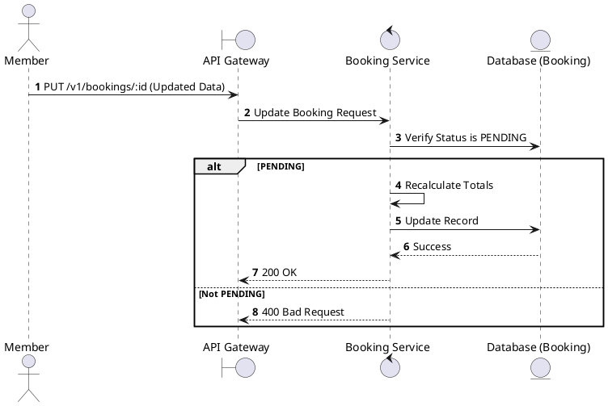
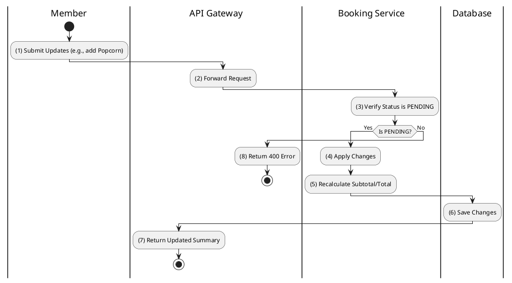

# [BK-06] Update Booking

## 1. Description

| Field | Details |
| :--- | :--- |
| **Name** | Update Booking |
| **Functional ID** | BK-06 |
| **Description** | Allows updating booking details (e.g., adding concessions or applying a promotion) while in PENDING status. |
| **Actor** | Member |
| **Trigger** | `PUT /v1/bookings/:id` |
| **Pre-condition** | Booking belongs to Member; Status is PENDING. |
| **Post-condition** | Booking updated; Total price recalculated. |

## 2. Sequence Flow

## 3. Activity Flow

## 4. Business Rules

| Activity Step | Rule ID | Description |
| :--- | :--- | :--- |
| (2) | BR134 | Member must own the booking before update is allowed. |
| (3) | BR135 | Only `PENDING` bookings inside the active seat/payment window can be updated. |
| (3) | BR136 | Update must validate that the selected seats are still held by the same user and have not been sold. |
| (4) | BR137 | Concession updates must validate item existence, availability, and requested quantity. |
| (5) | BR138 | Promotions and loyalty points must be recalculated server-side; client totals are not authoritative. |
| (5) | BR139 | VAT and final amount must be recalculated after every seat, concession, promotion, or loyalty change. |
| (6) | BR140 | Existing ticket/concession rows must be replaced consistently so duplicate line items are not created. |

