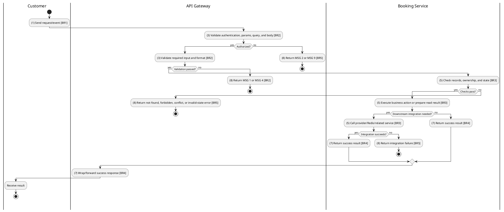
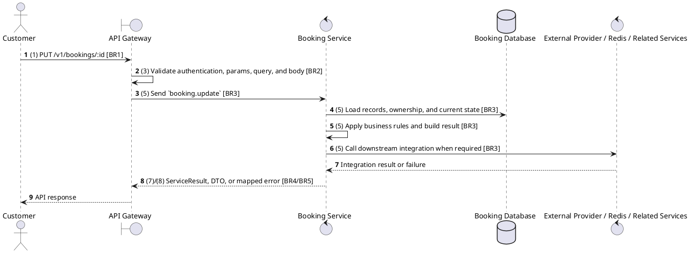

# [BK-06] Update Booking

## Use Case Description

| Field | Details |
| :--- | :--- |
| **Name** | Update Booking |
| **Description** | Allows updating booking details (e.g., adding concessions or applying a promotion) while in PENDING status. |
| **Actor** | Customer |
| **Trigger** | `PUT /v1/bookings/:id` |
| **Pre-condition** | Customer or staff has access to the booking context; showtime, seat, payment, and refund prerequisites are valid for the requested action. |
| **Post-condition** | State change is persisted atomically or the request fails without partial data inconsistency. |

## Activities Flow

## Sequence Flow

## Business Rules

| Activity | BR Code | Description |
| :--- | :--- | :--- |
| (1) | BR1 | Loading Screen Rules: ❖ The system loads the "Update Booking" function and receives the request/event. ❖ The system uses trigger [PUT /v1/bookings/:id]. |
| (3) | BR2 | Validate Rules: ❖ The system checks the items [id], [seats], [seatId], [ticketType], [concessions], [concessionId], [quantity], [promotionCode], [usePoints]. ❖ The system validates data according to DTO/schema UpdateBookingDto. ❖ Required fields: [id], [seatId], [ticketType], [concessionId], [quantity]. ❖ If any required entries are empty, the system shows error message MSG 1. ❖ Optional fields: [seats], [concessions], [promotionCode], [usePoints]. ❖ Field constraint: [id] is required, type string, path parameter. ❖ Field constraint: [seats] is optional, type Array<{. ❖ Field constraint: [seatId] is required, type string. ❖ Field constraint: [ticketType] is required, type string. ❖ Field constraint: [concessions] is optional, type Array<{. ❖ Field constraint: [concessionId] is required, type string. ❖ Field constraint: [quantity] is required, type number. ❖ Field constraint: [promotionCode] is optional, type string. ❖ Field constraint: [usePoints] is optional, type number. ❖ If any type, format, enum, range, date, UUID, or email constraint is invalid, the system shows error message MSG 4. |
| (5) | BR3 | Updating Rules: ❖ The system executes the main business operation and returns the requested data or persists the state change consistently. ❖ Update actions must merge only allowed DTO fields and leave omitted fields unchanged. |
| (7) | BR4 | Message Rules: ❖ Successful write/validation/state-changing operations return service data with MSG 7 where the service wraps a ServiceResult; pure reads return the requested DTO/list. |
| (8) | BR5 | Error Handling Rules: ❖ Expected failures include Booking not found, Cannot cancel this booking, Can only update pending bookings, Cannot reschedule cancelled booking, Cannot reschedule completed booking, invalid/expired promotion, loyalty balance errors, and downstream cinema lookup failures. ❖ If a constraint, conflict, or unexpected failure occurs, the system shows error message MSG 9. |
