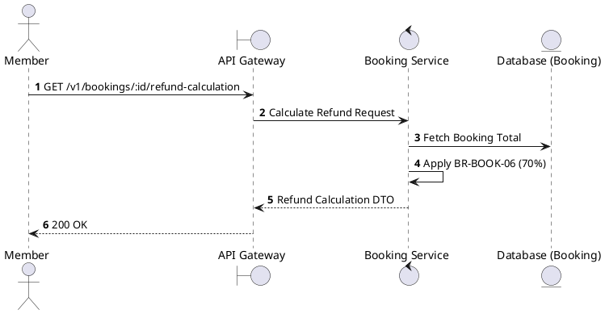
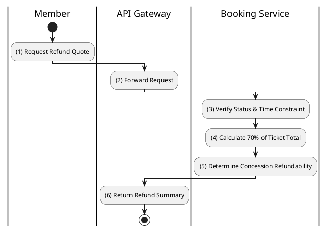

# [BK-08] Calculate Refund

## 1. Description

| Field | Details |
| :--- | :--- |
| **Name** | Calculate Refund |
| **Functional ID** | BK-08 |
| **Description** | Calculates the potential refund amount for a booking cancellation based on business rules. |
| **Actor** | Member |
| **Trigger** | `GET /v1/bookings/:id/refund-calculation` |
| **Pre-condition** | Booking exists and is CONFIRMED. |
| **Post-condition** | Potential refund amount and breakdown returned. |

## 2. Sequence Flow

## 3. Activity Flow

## 4. Business Rules

| Activity Step | Rule ID | Description |
| :--- | :--- | :--- |
| (2) | BR148 | Member must own the booking before refund calculation is returned. |
| (3) | BR149 | Refund eligibility must check booking status, showtime start time, and whether the booking was already cancelled/refunded. |
| (3) | BR150 | Current legacy refund calculation requires cancellation at least 2 hours before showtime. |
| (4) | BR151 | Current legacy refund amount is 70% of ticket price only; concessions and service fees are non-refundable. |
| (4) | BR152 | The calculation response must include refund amount, refund percentage, ticket amount, concessions amount, eligibility reason, and deadline when available. |
| (5) | BR153 | Refund policy values must be configurable or isolated so future 24-hour voucher policy changes do not require broad code changes. |

