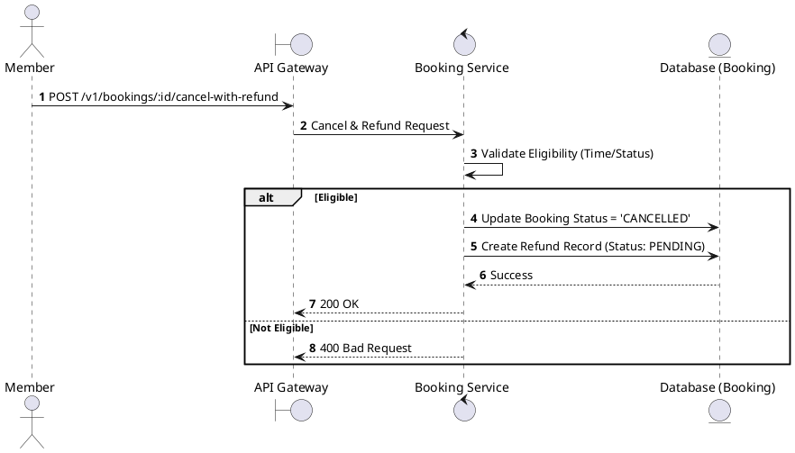
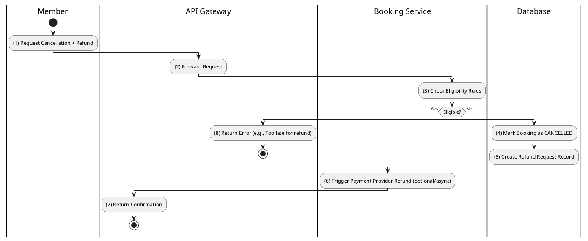

# [BK-09] Cancel with Refund

## 1. Description

| Field | Details |
| :--- | :--- |
| **Name** | Cancel with Refund |
| **Functional ID** | BK-09 |
| **Description** | Processes a cancellation and initiates a refund request in one operation. |
| **Actor** | Member |
| **Trigger** | `POST /v1/bookings/:id/cancel-with-refund` |
| **Pre-condition** | Member authenticated; Booking eligible for refund. |
| **Post-condition** | Booking status `CANCELLED`; Refund record created with status `PENDING`. |

## 2. Sequence Flow

## 3. Activity Flow

## 4. Business Rules

| Activity Step | Rule ID | Description |
| :--- | :--- | :--- |
| (2) | BR154 | Member must own the booking and pass refund eligibility checks before refund cancellation is processed. |
| (3) | BR155 | Current legacy flow requires cancellation at least 2 hours before showtime; voucher refund flow is handled by the refund module. |
| (3) | BR156 | Current legacy refund amount is 70% of ticket price only; concessions remain non-refundable. |
| (4) | BR157 | Booking cancellation and refund request creation must not leave payment, ticket, or booking states inconsistent. |
| (5) | BR158 | The system must return refund calculation details even when the user is not eligible, including the reason. |
| (6) | BR159 | Refund processing must be retryable and auditable because payment gateway or voucher generation can fail independently. |

