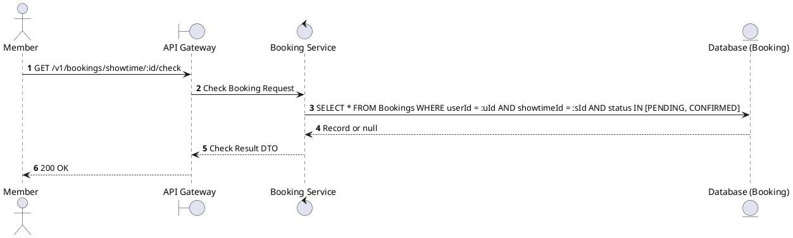
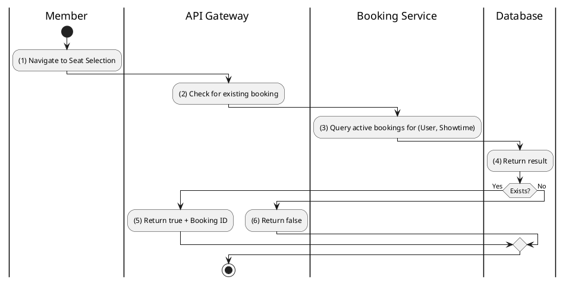

# [BK-10] Check User Booking at Showtime

## 1. Description

| Field | Details |
| :--- | :--- |
| **Name** | Check User Booking at Showtime |
| **Functional ID** | BK-10 |
| **Description** | Checks if the user already has a pending or confirmed booking for a specific showtime. |
| **Actor** | Member |
| **Trigger** | `GET /v1/bookings/showtime/:showtimeId/check` |
| **Pre-condition** | Member authenticated. |
| **Post-condition** | Boolean status and booking ID (if exists) returned. |

## 2. Sequence Flow

## 3. Activity Flow

## 4. Business Rules

| Activity Step | Rule ID | Description |
| :--- | :--- | :--- |
| (2) | BR160 | Member must be authenticated before checking active booking state. |
| (3) | BR161 | The lookup must return the latest matching booking for the user and showtime. |
| (3) | BR162 | By default, only active `PENDING` bookings are checked unless caller explicitly includes additional statuses. |
| (3) | BR163 | If the booking has a pending payment, the response should include the payment resume information from booking summary. |
| (4) | BR164 | This check prevents duplicate active bookings for the same user and showtime. |
| (4) | BR165 | The response must return `null` when no matching booking exists rather than creating a new booking implicitly. |

