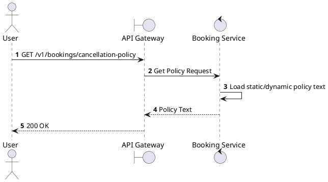
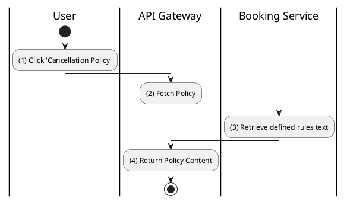

# [BK-11] Get Cancellation Policy

## 1. Description

| Field | Details |
| :--- | :--- |
| **Name** | Get Cancellation Policy |
| **Functional ID** | BK-11 |
| **Description** | Returns the human-readable text of the platform's cancellation and refund policy. |
| **Actor** | Guest, Member |
| **Trigger** | `GET /v1/bookings/cancellation-policy` |
| **Pre-condition** | None. |
| **Post-condition** | Policy text returned. |

## 2. Sequence Flow

## 3. Activity Flow

## 4. Business Rules

| Activity Step | Rule ID | Description |
| :--- | :--- | :--- |
| (3) | BR166 | Policy response must expose the current cancellation deadline used by booking-service. |
| (3) | BR167 | Policy response must expose the current refund percentage and whether concessions/service fees are refundable. |
| (3) | BR168 | Policy response must expose the maximum reschedule count. |
| (3) | BR169 | Policy text must be understandable to members before they confirm cancellation or exchange. |
| (3) | BR170 | Policy constants must be easy to update when business rules change. |

