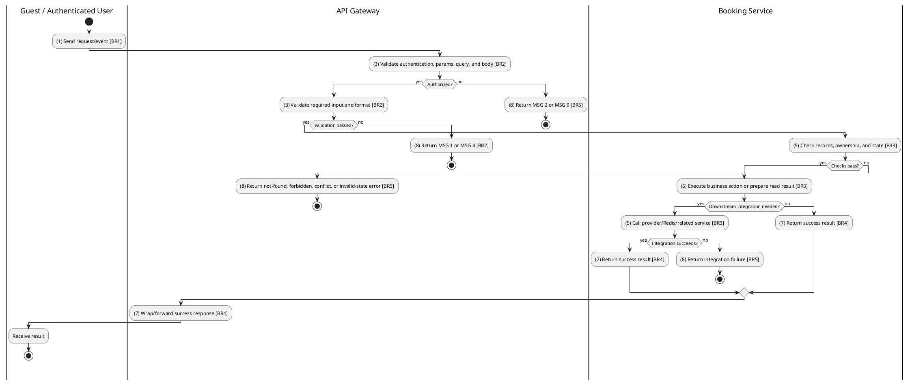
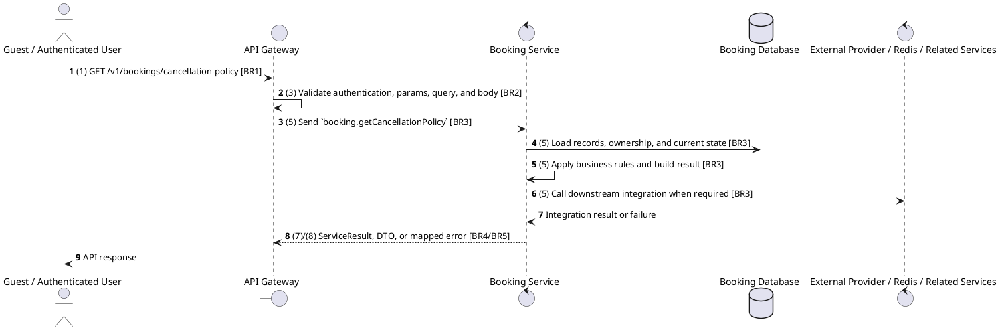

# [BK-11] Get Cancellation Policy

## Use Case Description

| Field | Details |
| :--- | :--- |
| **Name** | Get Cancellation Policy |
| **Description** | Returns the human-readable text of the platform's cancellation and refund policy. |
| **Actor** | Guest / Authenticated User |
| **Trigger** | `GET /v1/bookings/cancellation-policy` |
| **Pre-condition** | Customer or staff has access to the booking context; showtime, seat, payment, and refund prerequisites are valid for the requested action. |
| **Post-condition** | Booking status/payment/ticket/refund data remains consistent with the performed operation. |

## Activities Flow

## Sequence Flow

## Business Rules

| Activity | BR Code | Description |
| :--- | :--- | :--- |
| (1) | BR1 | Loading Screen Rules: ❖ The system loads the "Get Cancellation Policy" function and receives the request/event. ❖ The system uses trigger [GET /v1/bookings/cancellation-policy]. |
| (3) | BR2 | Validate Rules: ❖ The system checks actor permission, path parameters, query values, and request body before processing. ❖ Endpoint is callable without a customer session; any staff context added by the gateway can narrow the returned data. ❖ Implemented trigger is GET /v1/bookings/cancellation-policy and service boundary uses booking.getCancellationPolicy; the gateway must not call stale or pluralized paths that differ from the controller. ❖ Booking ownership is enforced for customer endpoints; admin endpoints are scoped by cinema context when the authenticated staff account has a cinema assignment. ❖ If any mandatory entries are empty, the system shows error message MSG 1. ❖ If request information is not in the correct format, the system shows error message MSG 4. |
| (5) | BR3 | Retrieval Rules: ❖ The system executes the main business operation and returns the requested data or persists the state change consistently. |
| (7) | BR4 | Message Rules: ❖ Successful write/validation/state-changing operations return service data with MSG 7 where the service wraps a ServiceResult; pure reads return the requested DTO/list. |
| (8) | BR5 | Error Handling Rules: ❖ Expected failures include Booking not found, Cannot cancel this booking, Can only update pending bookings, Cannot reschedule cancelled booking, Cannot reschedule completed booking, invalid/expired promotion, loyalty balance errors, and downstream cinema lookup failures. ❖ If a constraint, conflict, or unexpected failure occurs, the system shows error message MSG 9. |
