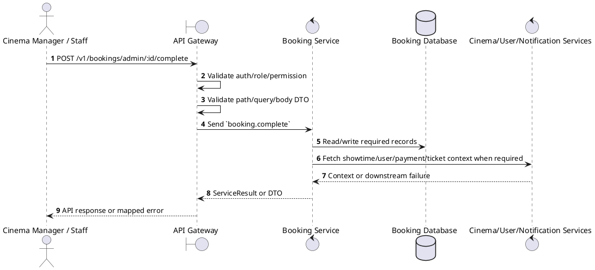
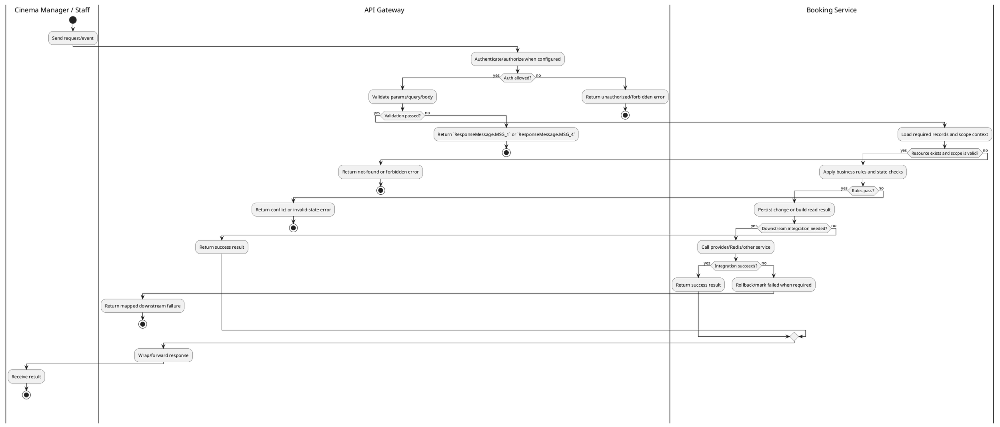

# [BK-A06] Complete Booking

## 1. Description

| Field | Details |
| :--- | :--- |
| **Name** | Complete Booking |
| **Functional ID** | BK-A06 |
| **Description** | Marks a CONFIRMED booking as COMPLETED. This usually happens automatically after the showtime ends or manually by an Admin. |
| **Actor** | Cinema Manager / Staff |
| **Trigger** | `POST /v1/bookings/admin/:id/complete` |
| **Pre-condition** | Customer or staff has access to the booking context; showtime, seat, payment, and refund prerequisites are valid for the requested action. |
| **Post-condition** | Booking status/payment/ticket/refund data remains consistent with the performed operation. |

## 2. Sequence Flow

## 3. Activity Flow

## 4. Business Rules

| Activity Step | Rule ID | Description |
| :--- | :--- | :--- |
| Gateway guard | BR-BK-A06-01 | Request must pass ClerkAuthGuard, RoleGuard where configured, and permission decorators for cinema/global scope before service dispatch. |
| Input validation | BR-BK-A06-02 | Path and query IDs must identify existing bookings/showtimes; status filters use BookingStatus and PaymentStatus enums, and pagination/date query values must be parseable before service dispatch. |
| Route/message boundary | BR-BK-A06-03 | Implemented trigger is `POST /v1/bookings/admin/:id/complete` and service boundary uses `booking.complete`; the gateway must not call stale or pluralized paths that differ from the controller. |
| Business/state rule | BR-BK-A06-04 | Booking ownership is enforced for customer endpoints; admin endpoints are scoped by cinema context when the authenticated staff account has a cinema assignment. |
| Business/state rule | BR-BK-A06-05 | Booking state transitions are limited to `PENDING -> CONFIRMED/CANCELLED/EXPIRED`, `CONFIRMED -> COMPLETED/CANCELLED/REFUNDED`; terminal states do not regress. |
| Business/state rule | BR-BK-A06-06 | Seat availability is derived from held Redis seats and persisted seat reservations; duplicate or expired holds must fail without creating inconsistent tickets. |
| Business/state rule | BR-BK-A06-07 | Refund/cancellation functions must use the configured cancellation policy, showtime timing, payment status, and refund percentage before changing booking state. |
| Integration constraint | BR-BK-A06-08 | Integration may call Cinema Service for showtime/seat context, User Service for customer data, payment/ticket/refund modules for state consistency, and uses microservice pattern `booking.complete`. |
| Success response | BR-BK-A06-09 | Successful write/validation/state-changing operations return service data with `ResponseMessage.MSG_7` where the service wraps a ServiceResult; pure reads return the requested DTO/list. |
| Failure response | BR-BK-A06-10 | Expected failures include `Booking not found`, `Cannot cancel this booking`, `Can only update pending bookings`, `Cannot reschedule cancelled booking`, `Cannot reschedule completed booking`, invalid/expired promotion, loyalty balance errors, and downstream cinema lookup failures. |
