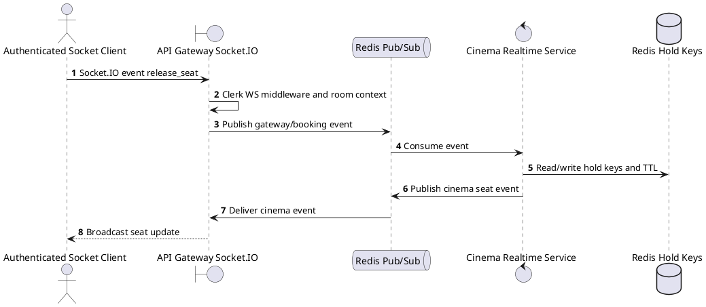
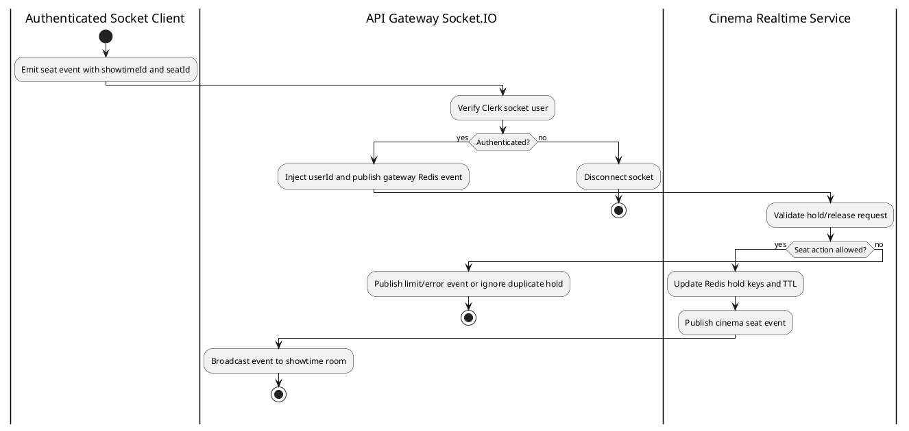

# [RT-02] Release Seat

## 1. Description

| Field | Details |
| :--- | :--- |
| **Name** | Release Seat |
| **Functional ID** | RT-02 |
| **Description** | Allows a member to manually release a seat they previously held. |
| **Actor** | Authenticated Socket Client |
| **Trigger** | `Socket.IO event release_seat` |
| **Pre-condition** | Socket is authenticated with Clerk and joined to the target showtime room when applicable. |
| **Post-condition** | Redis hold state and broadcast events reflect the seat action. |

## 2. Sequence Flow

## 3. Activity Flow

## 4. Business Rules

| Activity Step | Rule ID | Description |
| :--- | :--- | :--- |
| Gateway guard | BR-RT-02-01 | Socket connection must pass Clerk WebSocket middleware; unauthenticated clients are disconnected before room join or seat events. |
| Input validation | BR-RT-02-02 | SeatActionDto must include `showtimeId` and `seatId`; `userId` is injected from the authenticated socket, not accepted as authoritative client input. |
| Route/message boundary | BR-RT-02-03 | Implemented trigger is `Socket.IO event release_seat` and service boundary uses `gateway.release_seat -> cinema.seat_released`; the gateway must not call stale or pluralized paths that differ from the controller. |
| Business/state rule | BR-RT-02-04 | A user may hold at most 8 seats per showtime; exceeding the limit publishes `cinema.seat_limit_reached` without creating a new hold. |
| Business/state rule | BR-RT-02-05 | Seat holds use Redis keys `hold:showtime:{showtimeId}:{seatId}` and `hold:user:{userId}:showtime:{showtimeId}` with a 600-second TTL. |
| Business/state rule | BR-RT-02-06 | If the same user switches showtimes, old held seats are cleared before new holds are accepted. |
| Business/state rule | BR-RT-02-07 | Booking confirmation consumes held seats, removes Redis hold keys, creates seat reservations, and publishes `cinema.seat_booked` to connected clients. |
| Integration constraint | BR-RT-02-08 | Integration uses Socket.IO plus Redis pub/sub channels `gateway.hold_seat`, `gateway.release_seat`, `booking.confirmed`, `cinema.seat_held`, `cinema.seat_released`, `cinema.seat_expired`, `cinema.seat_booked`, and `cinema.seat_limit_reached`. |
| Success response | BR-RT-02-09 | Successful realtime actions publish the matching Redis/socket event; no REST `ResponseMessage` is produced. |
| Failure response | BR-RT-02-10 | Expected failures include unauthorized socket disconnect, silently ignored already-held seats, limit reached event, Redis failures, and showtime not found during booking resolution. |
