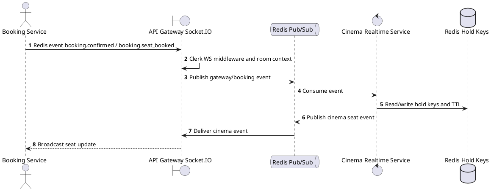
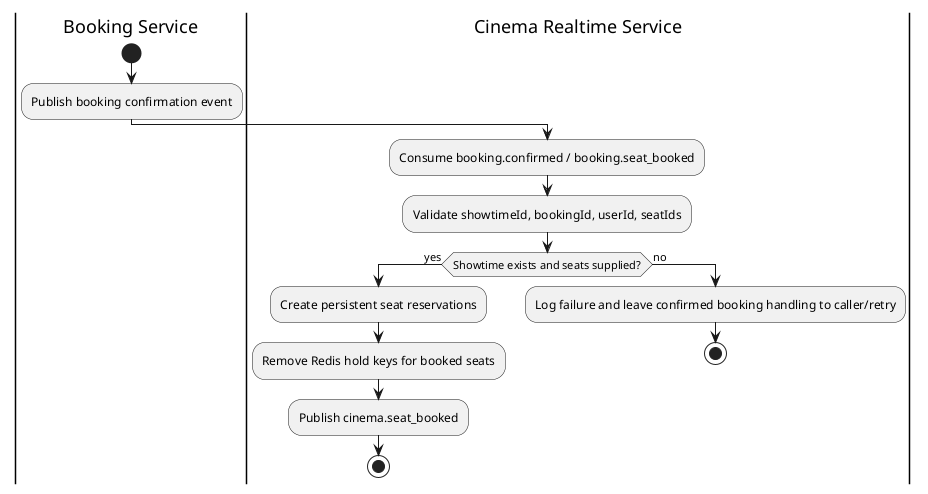

# [RT-03] Confirm Seat Booked

## 1. Description

| Field | Details |
| :--- | :--- |
| **Name** | Confirm Seat Booked |
| **Functional ID** | RT-03 |
| **Description** | Transitions a seat from 'Held' to 'Booked' status in the real-time layout once the booking is confirmed by the system. |
| **Actor** | Booking Service |
| **Trigger** | `Redis event booking.confirmed / booking.seat_booked` |
| **Pre-condition** | Booking confirmation event includes booking ID, user ID, showtime ID, and booked seat IDs. |
| **Post-condition** | Held seats are removed, persistent seat reservations are created, and clients receive `seat_booked`. |

## 2. Sequence Flow

## 3. Activity Flow

## 4. Business Rules

| Activity Step | Rule ID | Description |
| :--- | :--- | :--- |
| Gateway guard | BR-RT-03-01 | Realtime/internal queries run on trusted service paths; upstream customer/staff authentication must already have supplied the authoritative `userId` and `showtimeId` context. |
| Input validation | BR-RT-03-02 | SeatBookingEvent must include `showtimeId`, `userId`, `bookingId`, and a non-empty `seatIds` list before held seats are converted to booked reservations. |
| Route/message boundary | BR-RT-03-03 | Implemented trigger is `Redis event booking.confirmed / booking.seat_booked` and service boundary uses `booking.confirmed / booking.seat_booked -> cinema.seat_booked`; the gateway must not call stale or pluralized paths that differ from the controller. |
| Business/state rule | BR-RT-03-04 | A user may hold at most 8 seats per showtime; exceeding the limit publishes `cinema.seat_limit_reached` without creating a new hold. |
| Business/state rule | BR-RT-03-05 | Seat holds use Redis keys `hold:showtime:{showtimeId}:{seatId}` and `hold:user:{userId}:showtime:{showtimeId}` with a 600-second TTL. |
| Business/state rule | BR-RT-03-06 | If the same user switches showtimes, old held seats are cleared before new holds are accepted. |
| Business/state rule | BR-RT-03-07 | Booking confirmation consumes held seats, removes Redis hold keys, creates seat reservations, and publishes `cinema.seat_booked` to connected clients. |
| Integration constraint | BR-RT-03-08 | Integration uses Socket.IO plus Redis pub/sub channels `gateway.hold_seat`, `gateway.release_seat`, `booking.confirmed`, `cinema.seat_held`, `cinema.seat_released`, `cinema.seat_expired`, `cinema.seat_booked`, and `cinema.seat_limit_reached`. |
| Success response | BR-RT-03-09 | Successful realtime actions publish the matching Redis/socket event; no REST `ResponseMessage` is produced. |
| Failure response | BR-RT-03-10 | Expected failures include unauthorized socket disconnect, silently ignored already-held seats, limit reached event, Redis failures, and showtime not found during booking resolution. |
