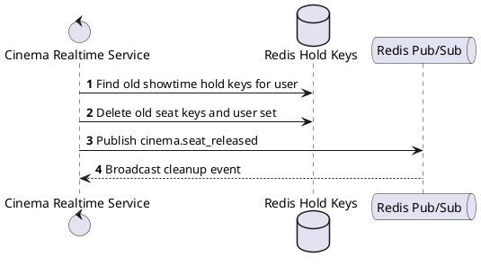
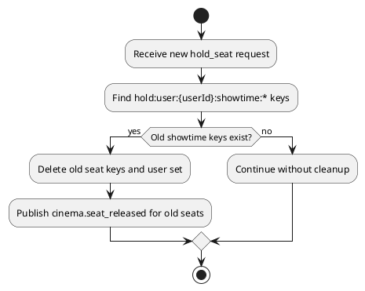

# [RT-04] Clear Old Showtime Session

## 1. Description

| Field | Details |
| :--- | :--- |
| **Name** | Clear Old Showtime Session |
| **Functional ID** | RT-04 |
| **Description** | Automatically releases all held seats from a previous showtime when a user navigates to a new showtime. |
| **Actor** | Cinema Realtime Service |
| **Trigger** | `Internal Redis cleanup during hold_seat` |
| **Pre-condition** | Trusted service caller supplies showtime/user context for Redis held-seat lookup or cleanup. |
| **Post-condition** | Redis hold keys are returned or cleaned without changing confirmed reservations. |

## 2. Sequence Flow

## 3. Activity Flow

## 4. Business Rules

| Activity Step | Rule ID | Description |
| :--- | :--- | :--- |
| Gateway guard | BR-RT-04-01 | Realtime/internal queries run on trusted service paths; upstream customer/staff authentication must already have supplied the authoritative `userId` and `showtimeId` context. |
| Input validation | BR-RT-04-02 | Redis cleanup requires current `userId` and the new `showtimeId` so old showtime keys can be removed without touching the active selection. |
| Route/message boundary | BR-RT-04-03 | Implemented trigger is `Internal Redis cleanup during hold_seat` and service boundary uses `clearOldShowtimeSession Redis key cleanup`; the gateway must not call stale or pluralized paths that differ from the controller. |
| Business/state rule | BR-RT-04-04 | A user may hold at most 8 seats per showtime; exceeding the limit publishes `cinema.seat_limit_reached` without creating a new hold. |
| Business/state rule | BR-RT-04-05 | Seat holds use Redis keys `hold:showtime:{showtimeId}:{seatId}` and `hold:user:{userId}:showtime:{showtimeId}` with a 600-second TTL. |
| Business/state rule | BR-RT-04-06 | If the same user switches showtimes, old held seats are cleared before new holds are accepted. |
| Business/state rule | BR-RT-04-07 | Booking confirmation consumes held seats, removes Redis hold keys, creates seat reservations, and publishes `cinema.seat_booked` to connected clients. |
| Integration constraint | BR-RT-04-08 | Integration reads/writes Redis hold keys directly and, for RT-06, exposes the result through Cinema Service message pattern `showtime.get_seats_held_by_user`. |
| Success response | BR-RT-04-09 | Successful realtime actions publish the matching Redis/socket event; no REST `ResponseMessage` is produced. |
| Failure response | BR-RT-04-10 | Expected failures include unauthorized socket disconnect, silently ignored already-held seats, limit reached event, Redis failures, and showtime not found during booking resolution. |
