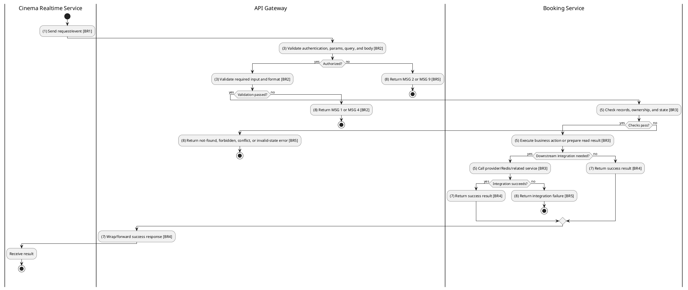
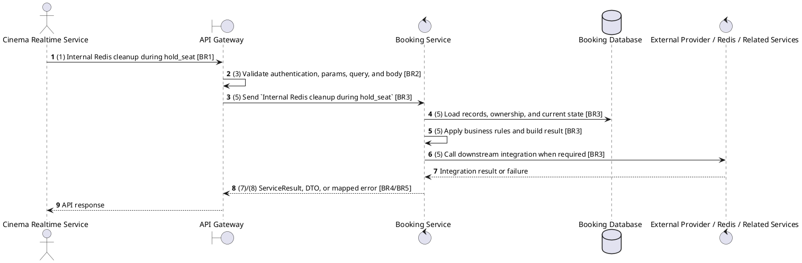

# [RT-04] Clear Old Showtime Session

## Use Case Description

| Field | Details |
| :--- | :--- |
| **Name** | Clear Old Showtime Session |
| **Description** | Automatically releases all held seats from a previous showtime when a user navigates to a new showtime. |
| **Actor** | Cinema Realtime Service |
| **Trigger** | `Internal Redis cleanup during hold_seat` |
| **Pre-condition** | Trusted service caller supplies showtime/user context for Redis held-seat lookup or cleanup. |
| **Post-condition** | Redis hold keys are returned or cleaned without changing confirmed reservations. |

## Activities Flow

## Sequence Flow

## Business Rules

| Activity | BR Code | Description |
| :--- | :--- | :--- |
| (1) | BR1 | Loading Screen Rules: ❖ The system loads the "Clear Old Showtime Session" function and receives the request/event. ❖ The system uses trigger [Internal Redis cleanup during hold_seat]. |
| (3) | BR2 | Validate Rules: ❖ The system checks actor permission, path parameters, query values, and request body before processing. ❖ Realtime/internal queries run on trusted service paths; upstream customer/staff authentication must already have supplied the authoritative userId and showtimeId context. ❖ Implemented trigger is Internal Redis cleanup during hold_seat and service boundary uses clearOldShowtimeSession Redis key cleanup; the gateway must not call stale or pluralized paths that differ from the controller. ❖ If any mandatory entries are empty, the system shows error message MSG 1. ❖ If request information is not in the correct format, the system shows error message MSG 4. |
| (5) | BR3 | Processing Rules: ❖ Redis cleanup requires current userId and the new showtimeId so old showtime keys can be removed without touching the active selection. ❖ A user may hold at most 8 seats per showtime; exceeding the limit publishes cinema.seat_limit_reached without creating a new hold. ❖ Seat holds use Redis keys hold:showtime:{showtimeId}:{seatId} and hold:user:{userId}:showtime:{showtimeId} with a 600-second TTL. ❖ If the same user switches showtimes, old held seats are cleared before new holds are accepted. ❖ Booking confirmation consumes held seats, removes Redis hold keys, creates seat reservations, and publishes cinema.seat_booked to connected clients. ❖ Integration reads/writes Redis hold keys directly and, for RT-06, exposes the result through Cinema Service message pattern showtime.get_seats_held_by_user. |
| (7) | BR4 | Message Rules: ❖ Successful realtime actions publish the matching Redis/socket event; no REST ResponseMessage is produced. |
| (8) | BR5 | Error Handling Rules: ❖ Expected failures include unauthorized socket disconnect, silently ignored already-held seats, limit reached event, Redis failures, and showtime not found during booking resolution. ❖ If a constraint, conflict, or unexpected failure occurs, the system shows error message MSG 9. |
