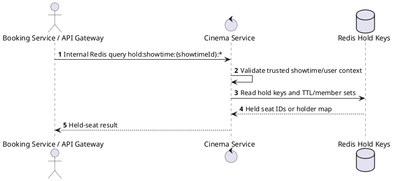
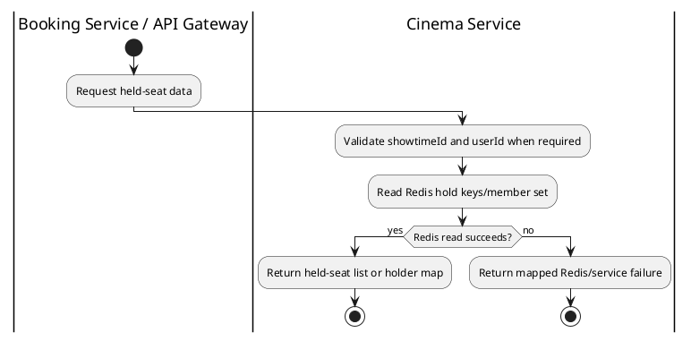

# [RT-05] Get All Held Seats

## 1. Description

| Field | Details |
| :--- | :--- |
| **Name** | Get All Held Seats |
| **Functional ID** | RT-05 |
| **Description** | Internal API call to retrieve all currently held seats for a showtime, typically used during initial layout load. |
| **Actor** | Booking Service / API Gateway |
| **Trigger** | `Internal Redis query hold:showtime:{showtimeId}:*` |
| **Pre-condition** | Trusted service caller supplies showtime/user context for Redis held-seat lookup or cleanup. |
| **Post-condition** | Redis hold keys are returned or cleaned without changing confirmed reservations. |

## 2. Sequence Flow

## 3. Activity Flow

## 4. Business Rules

| Activity Step | Rule ID | Description |
| :--- | :--- | :--- |
| Gateway guard | BR-RT-05-01 | Realtime/internal queries run on trusted service paths; upstream customer/staff authentication must already have supplied the authoritative `userId` and `showtimeId` context. |
| Input validation | BR-RT-05-02 | Held-seat query requires `showtimeId`; user-specific query also requires the authenticated/upstream `userId`. |
| Route/message boundary | BR-RT-05-03 | Implemented trigger is `Internal Redis query hold:showtime:{showtimeId}:*` and service boundary uses `Redis scan hold:showtime:{showtimeId}:*`; the gateway must not call stale or pluralized paths that differ from the controller. |
| Business/state rule | BR-RT-05-04 | A user may hold at most 8 seats per showtime; exceeding the limit publishes `cinema.seat_limit_reached` without creating a new hold. |
| Business/state rule | BR-RT-05-05 | Seat holds use Redis keys `hold:showtime:{showtimeId}:{seatId}` and `hold:user:{userId}:showtime:{showtimeId}` with a 600-second TTL. |
| Business/state rule | BR-RT-05-06 | If the same user switches showtimes, old held seats are cleared before new holds are accepted. |
| Business/state rule | BR-RT-05-07 | Booking confirmation consumes held seats, removes Redis hold keys, creates seat reservations, and publishes `cinema.seat_booked` to connected clients. |
| Business/state rule | BR-RT-05-08 | List responses must honor supported filters, pagination defaults, and cinema/user scoping before returning data. |
| Integration constraint | BR-RT-05-09 | Integration reads/writes Redis hold keys directly and, for RT-06, exposes the result through Cinema Service message pattern `showtime.get_seats_held_by_user`. |
| Success response | BR-RT-05-10 | Successful held-seat read returns the Redis holder map or user seat list; no REST `ResponseMessage` is produced by the realtime service. |
| Failure response | BR-RT-05-11 | Expected failures include unauthorized socket disconnect, silently ignored already-held seats, limit reached event, Redis failures, and showtime not found during booking resolution. |
