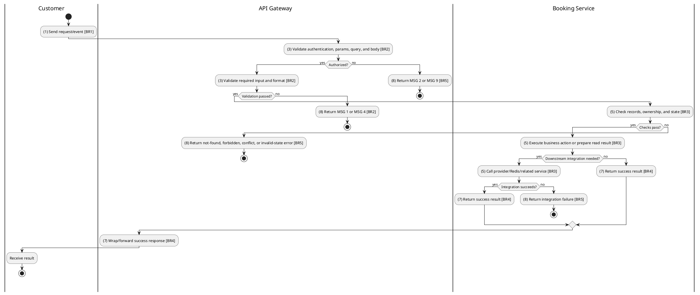
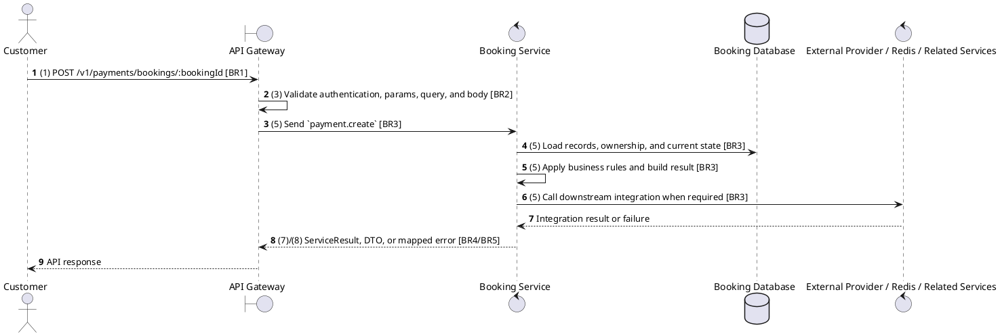

# [PY-01] Create Payment

## Use Case Description

| Field | Details |
| :--- | :--- |
| **Name** | Create Payment |
| **Description** | Initiates a payment transaction for a specific booking using a chosen payment gateway (e.g., VNPay). |
| **Actor** | Customer |
| **Trigger** | `POST /v1/payments/bookings/:bookingId` |
| **Pre-condition** | Booking exists, belongs to the customer, remains pending, and is inside the payment window. |
| **Post-condition** | State change is persisted atomically or the request fails without partial data inconsistency. |

## Activities Flow

## Sequence Flow

## Business Rules

| Activity | BR Code | Description |
| :--- | :--- | :--- |
| (1) | BR1 | Loading Screen Rules: ❖ The system loads the "Create Payment" function and receives the request/event. ❖ The system uses trigger [POST /v1/payments/bookings/:bookingId]. |
| (3) | BR2 | Validate Rules: ❖ The system checks the items [bookingId], [paymentMethod], [amount], [returnUrl], [cancelUrl]. ❖ The system validates data according to DTO/schema CreatePaymentDto. ❖ Required fields: [bookingId]. ❖ If any required entries are empty, the system shows error message MSG 1. ❖ Optional fields: [paymentMethod], [amount], [returnUrl], [cancelUrl]. ❖ Field constraint: [bookingId] is required, type string, path parameter. ❖ Field constraint: [paymentMethod] is optional, type PaymentMethod. ❖ Field constraint: [amount] is optional, type number. ❖ Field constraint: [returnUrl] is optional, type string. ❖ Field constraint: [cancelUrl] is optional, type string. ❖ If any type, format, enum, range, date, UUID, or email constraint is invalid, the system shows error message MSG 4. |
| (5) | BR3 | Creating Rules: ❖ Payment state transitions are PROCESSING -> PENDING -> COMPLETED/FAILED; COMPLETED, FAILED, and REFUNDED are terminal for normal provider callbacks. ❖ Payment creation is idempotent for the same booking, method, and amount; reusable PENDING payment URLs are returned until the booking/payment window expires. ❖ Only VNPay and ZaloPay adapters are implemented for online redirects; MoMo, Stripe, card, QR, and online banking are extension points until adapters are added. ❖ Create actions must reject duplicate/conflicting records before persistence and return the created DTO after persistence. |
| (7) | BR4 | Message Rules: ❖ Successful write/validation/state-changing operations return service data with MSG 7 where the service wraps a ServiceResult; pure reads return the requested DTO/list. |
| (8) | BR5 | Error Handling Rules: ❖ Expected failures include Payment not found, Booking not found, You do not have access to this booking payments, Booking is not pending payment, Booking payment window has expired, Payment method {method} is not supported, Can only cancel pending payments, and Unable to initiate payment. Please retry later. ❖ If a constraint, conflict, or unexpected failure occurs, the system shows error message MSG 9. |
