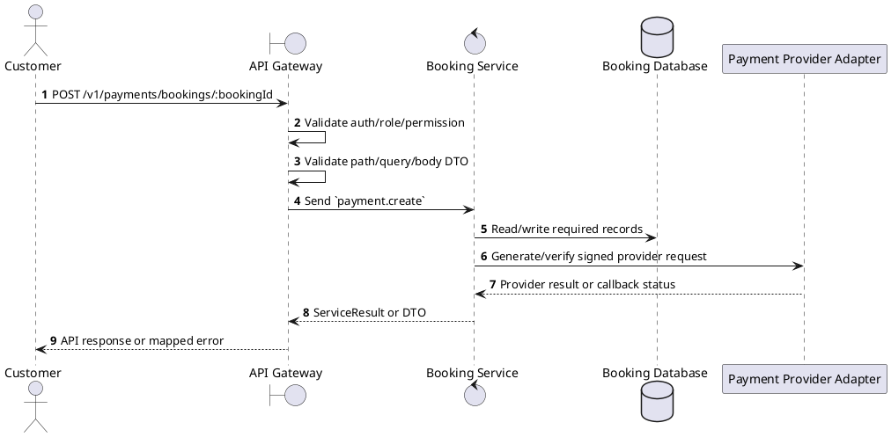
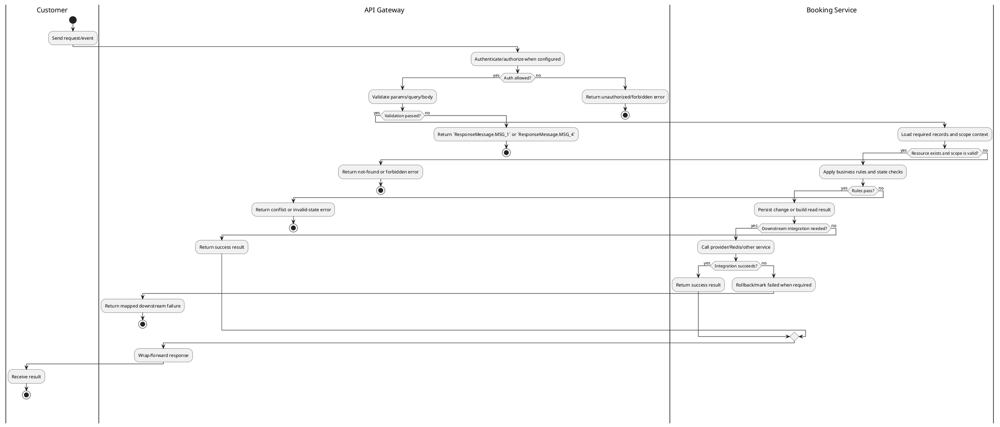

# [PY-01] Create Payment

## 1. Description

| Field | Details |
| :--- | :--- |
| **Name** | Create Payment |
| **Functional ID** | PY-01 |
| **Description** | Initiates a payment transaction for a specific booking using a chosen payment gateway (e.g., VNPay). |
| **Actor** | Customer |
| **Trigger** | `POST /v1/payments/bookings/:bookingId` |
| **Pre-condition** | Booking exists, belongs to the customer, remains pending, and is inside the payment window. |
| **Post-condition** | State change is persisted atomically or the request fails without partial data inconsistency. |

## 2. Sequence Flow

## 3. Activity Flow

## 4. Business Rules

| Activity Step | Rule ID | Description |
| :--- | :--- | :--- |
| Gateway guard | BR-PY-01-01 | Customer request must pass ClerkAuthGuard; own-scope permissions and ownership checks prevent access to another user's booking, payment, ticket, loyalty, or refund data. |
| Input validation | BR-PY-01-02 | CreatePaymentDto accepts optional `paymentMethod`, `amount`, `returnUrl`, and `cancelUrl`; the persisted booking final amount is authoritative and unsupported PaymentMethod values are rejected. |
| Route/message boundary | BR-PY-01-03 | Implemented trigger is `POST /v1/payments/bookings/:bookingId` and service boundary uses `payment.create`; the gateway must not call stale or pluralized paths that differ from the controller. |
| Business/state rule | BR-PY-01-04 | Payment ownership is checked through the related booking before exposing or mutating payment data for customer routes. |
| Business/state rule | BR-PY-01-05 | Payment state transitions are `PROCESSING -> PENDING -> COMPLETED/FAILED`; `COMPLETED`, `FAILED`, and `REFUNDED` are terminal for normal provider callbacks. |
| Business/state rule | BR-PY-01-06 | Payment creation is idempotent for the same booking, method, and amount; reusable `PENDING` payment URLs are returned until the booking/payment window expires. |
| Business/state rule | BR-PY-01-07 | Only VNPay and ZaloPay adapters are implemented for online redirects; MoMo, Stripe, card, QR, and online banking are extension points until adapters are added. |
| Business/state rule | BR-PY-01-08 | Create actions must reject duplicate/conflicting records before persistence and return the created DTO after persistence. |
| Integration constraint | BR-PY-01-09 | Integration includes signed provider calls/callbacks and Booking Service updates; gateway route uses the microservice pattern `payment.create`. |
| Success response | BR-PY-01-10 | Successful write/validation/state-changing operations return service data with `ResponseMessage.MSG_7` where the service wraps a ServiceResult; pure reads return the requested DTO/list. |
| Failure response | BR-PY-01-11 | Expected failures include `Payment not found`, `Booking not found`, `You do not have access to this booking payments`, `Booking is not pending payment`, `Booking payment window has expired`, `Payment method {method} is not supported`, `Can only cancel pending payments`, and `Unable to initiate payment. Please retry later.` |
