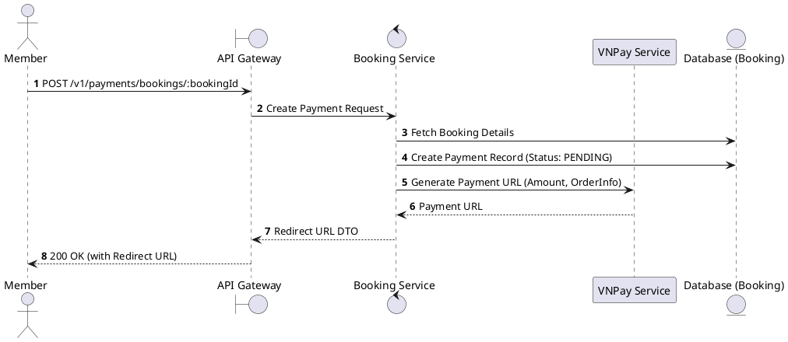
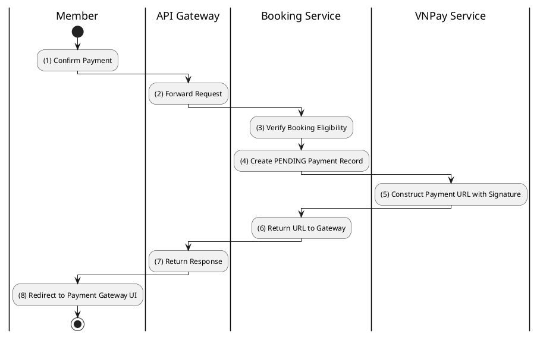

# [PY-01] Create Payment

## 1. Description

| Field | Details |
| :--- | :--- |
| **Name** | Create Payment |
| **Functional ID** | PY-01 |
| **Description** | Initiates a payment transaction for a specific booking using a chosen payment gateway (e.g., VNPay). |
| **Actor** | Member |
| **Trigger** | `POST /v1/payments/bookings/:bookingId` |
| **Pre-condition** | Booking exists and status is PENDING; Member authenticated. |
| **Post-condition** | Payment record created (PENDING); Redirect URL generated for the member. |

## 2. Sequence Flow

## 3. Activity Flow

## 4. Business Rules

| Activity Step | Rule ID | Description |
| :--- | :--- | :--- |
| (3) | BR171 | Booking must exist, belong to the authenticated member, be `PENDING`, and still be inside the payment window. |
| (3) | BR172 | Payment amount must be derived from the persisted booking `final_amount`; client-provided totals are not authoritative. |
| (4) | BR173 | Payment initiation must be idempotent for the same booking, method, and amount; an existing `PENDING` payment returns its reusable `paymentUrl`. |
| (4) | BR174 | Initial internal payment state is `PROCESSING`; it moves to `PENDING` only after a provider URL is successfully generated. |
| (5) | BR175 | VNPay URL must be signed with HMAC-SHA512; ZaloPay requests must be signed with configured MAC keys. |
| (5) | BR176 | Currently implemented online gateways are VNPay and ZaloPay; MoMo, Stripe, credit card, QR, and online banking are extension points unless adapters are added. |
| (5) | BR177 | Provider initiation must complete quickly under normal conditions and fail with a generic retryable message if the gateway times out or is unavailable. |
| (4) | BR178 | Zero-amount bookings are confirmed internally without redirecting to an external gateway, while still creating an auditable payment record. |

