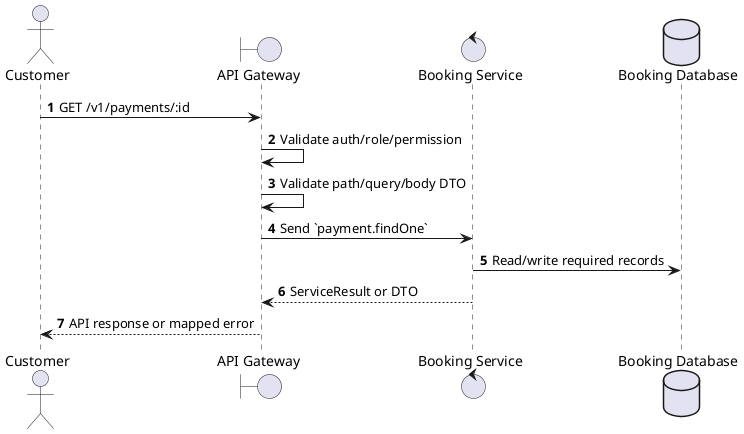
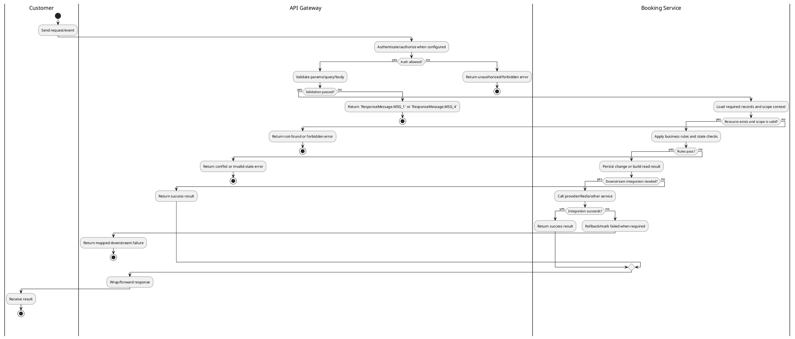

# [PY-02] Get Payment Details

## 1. Description

| Field | Details |
| :--- | :--- |
| **Name** | Get Payment Details |
| **Functional ID** | PY-02 |
| **Description** | Retrieves the status and transaction details of a specific payment. |
| **Actor** | Customer |
| **Trigger** | `GET /v1/payments/:id` |
| **Pre-condition** | Payment or booking exists and the customer owns the related booking. |
| **Post-condition** | Payment detail/list is returned without mutating provider or payment state. |

## 2. Sequence Flow

## 3. Activity Flow

## 4. Business Rules

| Activity Step | Rule ID | Description |
| :--- | :--- | :--- |
| Gateway guard | BR-PY-02-01 | Customer request must pass ClerkAuthGuard; own-scope permissions and ownership checks prevent access to another user's booking, payment, ticket, loyalty, or refund data. |
| Input validation | BR-PY-02-02 | Required path IDs (`id`, `bookingId`, or payment ID) must be present; lookup/cancel operations verify the referenced payment or booking before returning data or changing state. |
| Route/message boundary | BR-PY-02-03 | Implemented trigger is `GET /v1/payments/:id` and service boundary uses `payment.findOne`; the gateway must not call stale or pluralized paths that differ from the controller. |
| Business/state rule | BR-PY-02-04 | Payment ownership is checked through the related booking before exposing or mutating payment data for customer routes. |
| Business/state rule | BR-PY-02-05 | Payment state transitions are `PROCESSING -> PENDING -> COMPLETED/FAILED`; `COMPLETED`, `FAILED`, and `REFUNDED` are terminal for normal provider callbacks. |
| Business/state rule | BR-PY-02-06 | Read/list/statistics operations must not contact the provider adapter or mutate payment state unless reconciliation code is explicitly invoked. |
| Integration constraint | BR-PY-02-07 | Integration stays inside Booking Service and Booking Database for this operation; gateway route uses the microservice pattern `payment.findOne` and must not re-query the provider unless reconciliation code is explicitly invoked. |
| Success response | BR-PY-02-08 | Successful read operations return the requested DTO/list using the gateway's normal response wrapper; no artificial success text is invented by the spec. |
| Failure response | BR-PY-02-09 | Expected failures include `Payment not found`, `Booking not found`, `You do not have access to this booking payments`, `Booking is not pending payment`, `Booking payment window has expired`, `Payment method {method} is not supported`, `Can only cancel pending payments`, and `Unable to initiate payment. Please retry later.` |
