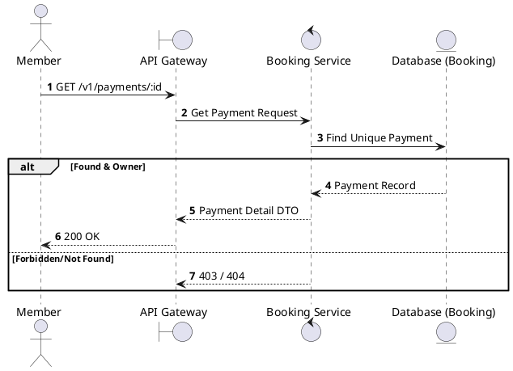
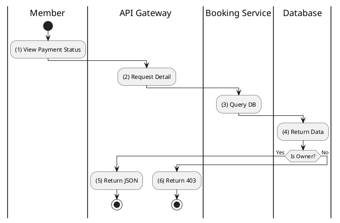

# [PY-02] Get Payment Details

## 1. Description

| Field | Details |
| :--- | :--- |
| **Name** | Get Payment Details |
| **Functional ID** | PY-02 |
| **Description** | Retrieves the status and transaction details of a specific payment. |
| **Actor** | Member |
| **Trigger** | `GET /v1/payments/:id` |
| **Pre-condition** | Member authenticated; Payment ID exists and belongs to the member. |
| **Post-condition** | Payment record details returned. |

## 2. Sequence Flow

## 3. Activity Flow

## 4. Business Rules

| Activity Step | Rule ID | Description |
| :--- | :--- | :--- |
| (2) | BR179 | Member must be authenticated before payment details are returned. |
| (3) | BR180 | Only the owner of the related booking can view the payment details. |
| (3) | BR181 | Response must include payment method, amount, status, transaction id, provider transaction id, payment URL when pending, and paid timestamp when completed. |
| (3) | BR182 | Sensitive provider secrets, secure hashes, OTP values, and raw PII must never be exposed in the response. |
| (5) | BR183 | Missing or unauthorized payments must not disclose another user's payment existence. |

