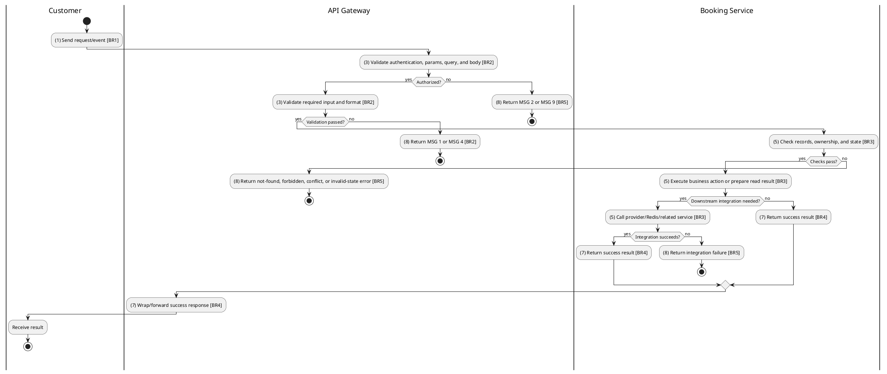
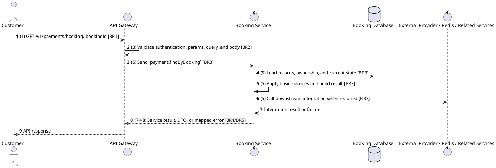

# [PY-03] Get Payments by Booking

## Use Case Description

| Field | Details |
| :--- | :--- |
| **Name** | Get Payments by Booking |
| **Description** | Lists all payment attempts associated with a specific booking. |
| **Actor** | Customer |
| **Trigger** | `GET /v1/payments/booking/:bookingId` |
| **Pre-condition** | Payment or booking exists and the customer owns the related booking. |
| **Post-condition** | Payment detail/list is returned without mutating provider or payment state. |

## Activities Flow

## Sequence Flow

## Business Rules

| Activity | BR Code | Description |
| :--- | :--- | :--- |
| (1) | BR1 | Loading Screen Rules: ❖ The system loads the "Get Payments by Booking" function and receives the request/event. ❖ The system uses trigger [GET /v1/payments/booking/:bookingId]. |
| (3) | BR2 | Validate Rules: ❖ The system checks the items [bookingId]. ❖ Required fields: [bookingId]. ❖ If any required entries are empty, the system shows error message MSG 1. ❖ Field constraint: [bookingId] is required, type string, path parameter. ❖ If any type, format, enum, range, date, UUID, or email constraint is invalid, the system shows error message MSG 4. |
| (5) | BR3 | Retrieval Rules: ❖ Payment state transitions are PROCESSING -> PENDING -> COMPLETED/FAILED; COMPLETED, FAILED, and REFUNDED are terminal for normal provider callbacks. ❖ Read/list/statistics operations must not contact the provider adapter or mutate payment state unless reconciliation code is explicitly invoked. |
| (7) | BR4 | Message Rules: ❖ Successful read operations return the requested DTO/list using the gateway's normal response wrapper; no artificial success text is invented by the spec. |
| (8) | BR5 | Error Handling Rules: ❖ Expected failures include Payment not found, Booking not found, You do not have access to this booking payments, Booking is not pending payment, Booking payment window has expired, Payment method {method} is not supported, Can only cancel pending payments, and Unable to initiate payment. Please retry later. ❖ If a constraint, conflict, or unexpected failure occurs, the system shows error message MSG 9. |
