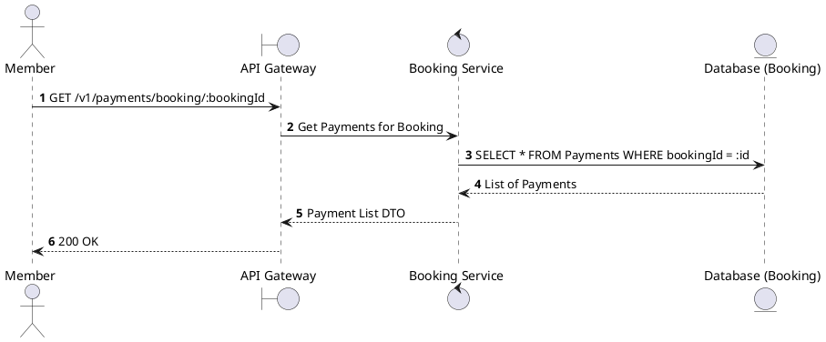
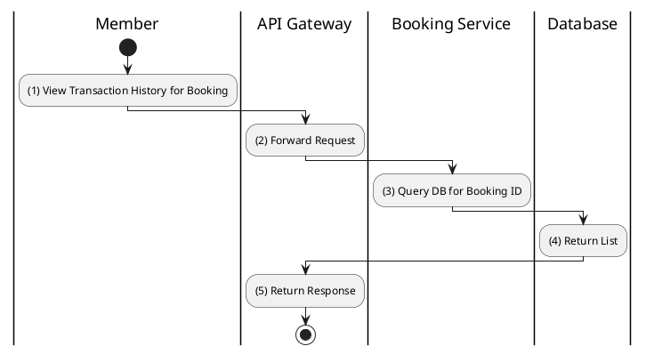

# [PY-03] Get Payments by Booking

## 1. Description

| Field | Details |
| :--- | :--- |
| **Name** | Get Payments by Booking |
| **Functional ID** | PY-03 |
| **Description** | Lists all payment attempts associated with a specific booking. |
| **Actor** | Member |
| **Trigger** | `GET /v1/payments/booking/:bookingId` |
| **Pre-condition** | Member authenticated; Booking belongs to the member. |
| **Post-condition** | List of payment records returned. |

## 2. Sequence Flow

## 3. Activity Flow

## 4. Business Rules

| Activity Step | Rule ID | Description |
| :--- | :--- | :--- |
| (2) | BR184 | Member must own the booking before payment history for that booking is returned. |
| (3) | BR185 | Payment history must include all attempts for the booking, including `PROCESSING`, `PENDING`, `COMPLETED`, `FAILED`, and `REFUNDED` records. |
| (3) | BR186 | Results must be sorted by newest attempt first so the latest pending payment can be resumed. |
| (5) | BR187 | The response must support failure diagnosis without exposing gateway secrets or raw webhook payloads. |
| (5) | BR188 | If a pending payment exists, consumers may use its stored `paymentUrl` to continue payment instead of creating a duplicate attempt. |

