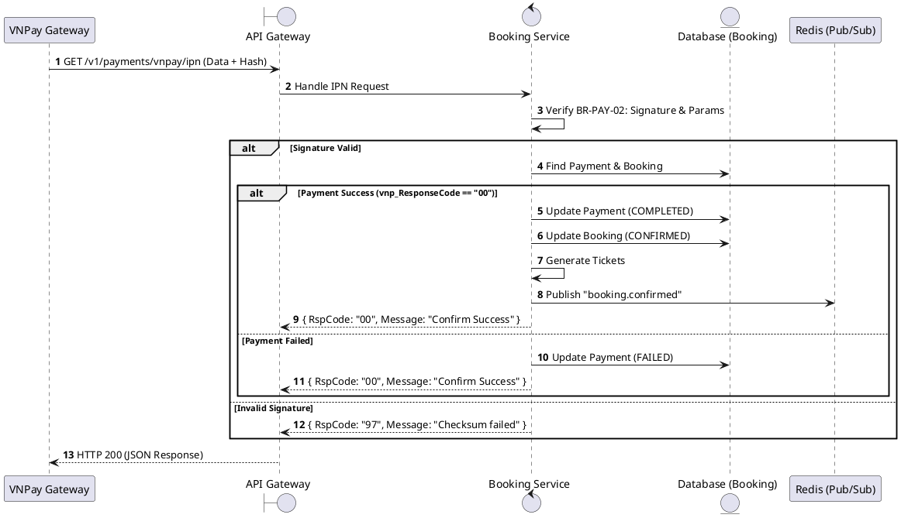
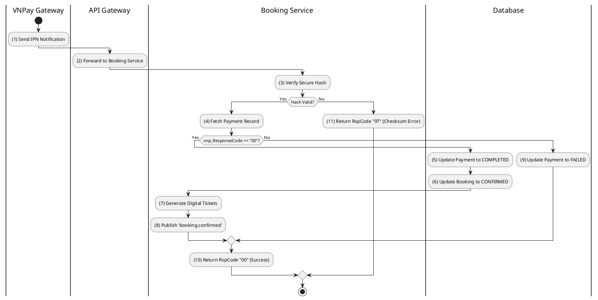

# [PY-04] VNPay IPN Webhook

## 1. Description

| Field | Details |
| :--- | :--- |
| **Name** | VNPay IPN Webhook |
| **Functional ID** | PY-04 |
| **Description** | An asynchronous callback from VNPay to update the payment and booking status after a transaction is completed by the user. |
| **Actor** | System (VNPay) |
| **Trigger** | `GET /v1/payments/vnpay/ipn` |
| **Pre-condition** | Request includes valid VNPay parameters and signature. |
| **Post-condition** | Payment status updated; Booking status confirmed if successful; Tickets generated. |

## 2. Sequence Flow

## 3. Activity Flow

## 4. Business Rules

| Activity Step | Rule ID | Description |
| :--- | :--- | :--- |
| (1) | BR189 | Gateway webhook endpoints are public but must be protected by provider signature validation and configured IP allowlist where available. |
| (3) | BR190 | VNPay callbacks must validate HMAC-SHA512 before any database mutation. |
| (3) | BR191 | Stale, duplicate, missing-identity, or invalid-signature callbacks must be acknowledged safely without mutating payment state. |
| (4) | BR192 | IPN must verify payment existence, booking existence, amount equality, booking expiry, and valid state before applying changes. |
| (5) | BR193 | Successful IPN transitions payment `PENDING -> COMPLETED`, booking `PENDING -> CONFIRMED`, and tickets to `VALID` in one atomic transaction. |
| (9) | BR194 | Failed provider status transitions payment `PENDING -> FAILED` and must not create valid tickets. |
| (8) | BR195 | Confirmation notification, QR generation, and Redis seat confirmation event must be triggered asynchronously and must not block the IPN response. |
| (10) | BR196 | VNPay IPN must return the exact provider response shape `{ RspCode: string, Message: string }`. |

