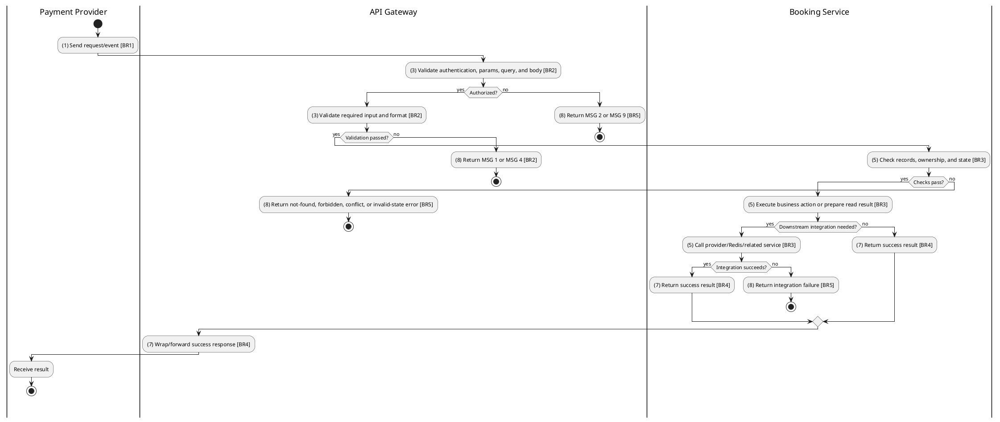
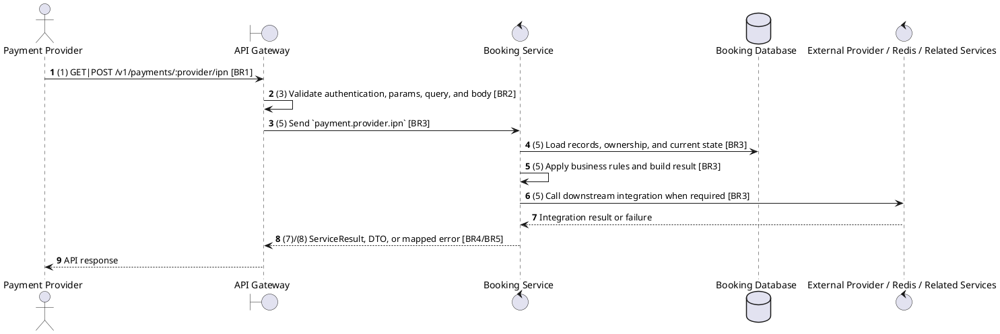

# [PY-04] VNPay IPN Webhook

## Use Case Description

| Field | Details |
| :--- | :--- |
| **Name** | VNPay IPN Webhook |
| **Description** | An asynchronous callback from VNPay to update the payment and booking status after a transaction is completed by the user. |
| **Actor** | Payment Provider |
| **Trigger** | `GET|POST /v1/payments/:provider/ipn` |
| **Pre-condition** | Provider payload includes the required signed parameters and maps to an existing payment. |
| **Post-condition** | Provider result is acknowledged and payment/booking/ticket state is advanced only when the transition is valid. |

## Activities Flow

## Sequence Flow

## Business Rules

| Activity | BR Code | Description |
| :--- | :--- | :--- |
| (1) | BR1 | Loading Screen Rules: ❖ The system loads the "VNPay IPN Webhook" function and receives the request/event. ❖ The system uses trigger [GET|POST /v1/payments/:provider/ipn]. |
| (3) | BR2 | Validate Rules: ❖ The system checks actor permission, path parameters, query values, and request body before processing. ❖ Public integration endpoint; provider/webhook authenticity is verified by signature, IP whitelist, or Clerk webhook envelope instead of a user session. ❖ Implemented trigger is GET\|POST /v1/payments/:provider/ipn and service boundary uses payment.provider.ipn; the gateway must not call stale or pluralized paths that differ from the controller. ❖ Payment ownership is checked through the related booking before exposing or mutating payment data for customer routes. ❖ Integration includes signed provider calls/callbacks and Booking Service updates; gateway route uses the microservice pattern payment.provider.ipn. ❖ If any mandatory entries are empty, the system shows error message MSG 1. ❖ If request information is not in the correct format, the system shows error message MSG 4. |
| (5) | BR3 | Creating Rules: ❖ Provider names are normalized to PaymentMethod enum values; unknown providers fail with Unsupported payment provider: {provider} and malformed provider payloads are rejected before state mutation. ❖ Payment state transitions are PROCESSING -> PENDING -> COMPLETED/FAILED; COMPLETED, FAILED, and REFUNDED are terminal for normal provider callbacks. ❖ A callback for a non-pending or stale payment must not regress terminal payment, booking, or ticket state. |
| (7) | BR4 | Message Rules: ❖ Successful provider IPN returns the raw provider-compatible acknowledgement payload, e.g. VNPay { RspCode, Message }, instead of the normal API wrapper. |
| (8) | BR5 | Error Handling Rules: ❖ Provider callbacks must verify signature and provider reference before applying completion/failure status. ❖ Expected failures include Payment not found, Booking not found, You do not have access to this booking payments, Booking is not pending payment, Booking payment window has expired, Payment method {method} is not supported, Can only cancel pending payments, and Unable to initiate payment. Please retry later. ❖ If a constraint, conflict, or unexpected failure occurs, the system shows error message MSG 9. |
