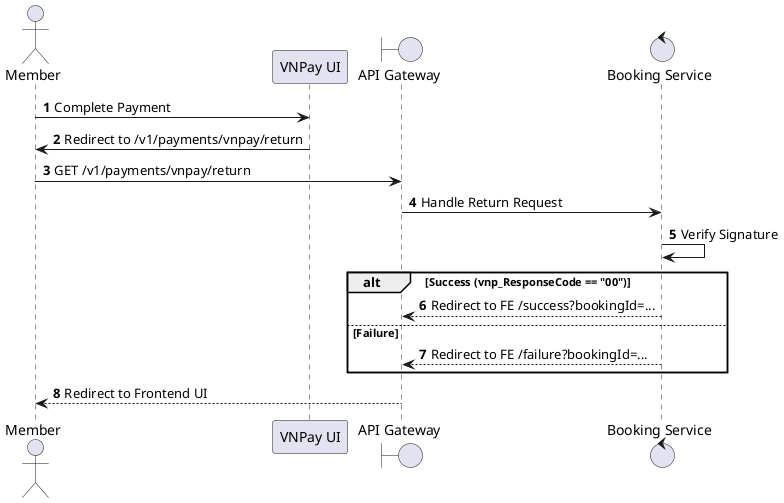
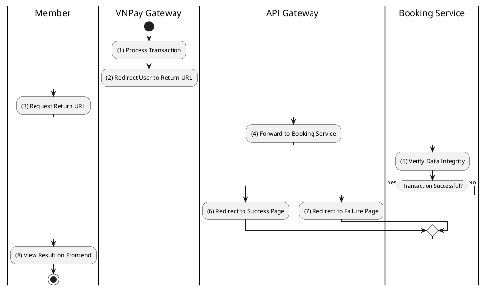

# [PY-05] VNPay Return URL

## 1. Description

| Field | Details |
| :--- | :--- |
| **Name** | VNPay Return URL |
| **Functional ID** | PY-05 |
| **Description** | The browser redirect endpoint where users are sent after completing payment on the VNPay UI. It provides immediate feedback to the user. |
| **Actor** | Member |
| **Trigger** | `GET /v1/payments/vnpay/return` |
| **Pre-condition** | User redirected from VNPay. |
| **Post-condition** | User redirected to Frontend success or failure page. |

## 2. Sequence Flow

## 3. Activity Flow

## 4. Business Rules

| Activity Step | Rule ID | Description |
| :--- | :--- | :--- |
| (3) | BR197 | Return URL validation must verify the provider signature before showing transaction status. |
| (5) | BR198 | Return URL gives immediate user feedback only; authoritative booking/payment consistency is handled by IPN/webhook processing. |
| (5) | BR199 | A successful return should guide the user to booking details/e-ticket access, but must not assume tickets are valid until backend confirmation is complete. |
| (5) | BR200 | A failed or cancelled return should let the user retry payment or choose another available payment method if the booking is still active. |
| (6) | BR201 | The checkout UI must support resuming an existing `PENDING` payment URL when the user navigates back before provider completion. |
| (6) | BR202 | User-facing status pages must avoid exposing provider secrets, secure hashes, or raw callback payloads. |

