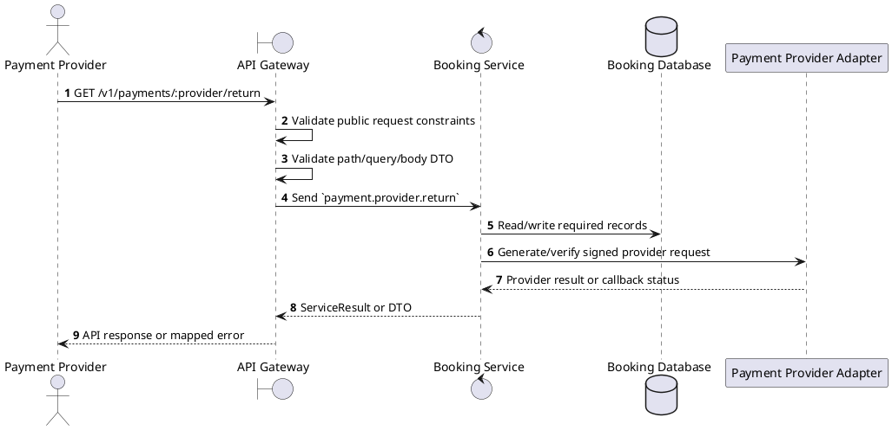
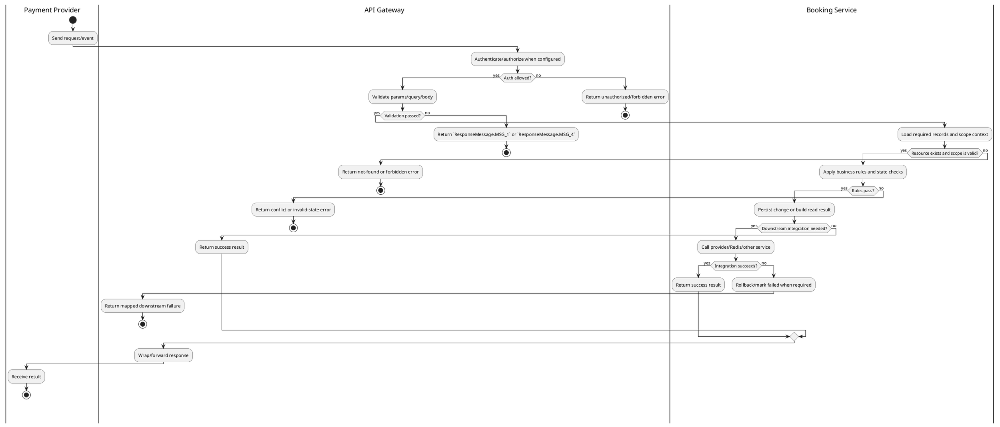

# [PY-05] VNPay Return URL

## 1. Description

| Field | Details |
| :--- | :--- |
| **Name** | VNPay Return URL |
| **Functional ID** | PY-05 |
| **Description** | The browser redirect endpoint where users are sent after completing payment on the VNPay UI. It provides immediate feedback to the user. |
| **Actor** | Payment Provider |
| **Trigger** | `GET /v1/payments/:provider/return` |
| **Pre-condition** | Provider payload includes the required signed parameters and maps to an existing payment. |
| **Post-condition** | Provider result is acknowledged and payment/booking/ticket state is advanced only when the transition is valid. |

## 2. Sequence Flow

## 3. Activity Flow

## 4. Business Rules

| Activity Step | Rule ID | Description |
| :--- | :--- | :--- |
| Gateway guard | BR-PY-05-01 | Public integration endpoint; provider/webhook authenticity is verified by signature, IP whitelist, or Clerk webhook envelope instead of a user session. |
| Input validation | BR-PY-05-02 | Provider names are normalized to PaymentMethod enum values; unknown providers fail with `Unsupported payment provider: {provider}` and malformed provider payloads are rejected before state mutation. |
| Route/message boundary | BR-PY-05-03 | Implemented trigger is `GET /v1/payments/:provider/return` and service boundary uses `payment.provider.return`; the gateway must not call stale or pluralized paths that differ from the controller. |
| Business/state rule | BR-PY-05-04 | Payment ownership is checked through the related booking before exposing or mutating payment data for customer routes. |
| Business/state rule | BR-PY-05-05 | Payment state transitions are `PROCESSING -> PENDING -> COMPLETED/FAILED`; `COMPLETED`, `FAILED`, and `REFUNDED` are terminal for normal provider callbacks. |
| Business/state rule | BR-PY-05-06 | Provider callbacks must verify signature and provider reference before applying completion/failure status. |
| Business/state rule | BR-PY-05-07 | A callback for a non-pending or stale payment must not regress terminal payment, booking, or ticket state. |
| Integration constraint | BR-PY-05-08 | Integration includes signed provider calls/callbacks and Booking Service updates; gateway route uses the microservice pattern `payment.provider.return`. |
| Success response | BR-PY-05-09 | Successful provider return resolves the payment status and returns the payment result/redirect data expected by the client. |
| Failure response | BR-PY-05-10 | Expected failures include `Payment not found`, `Booking not found`, `You do not have access to this booking payments`, `Booking is not pending payment`, `Booking payment window has expired`, `Payment method {method} is not supported`, `Can only cancel pending payments`, and `Unable to initiate payment. Please retry later.` |
