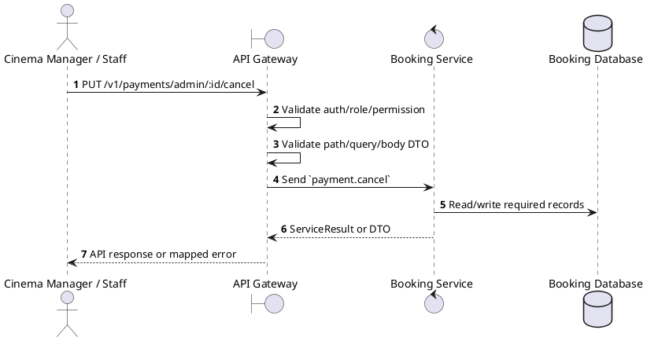
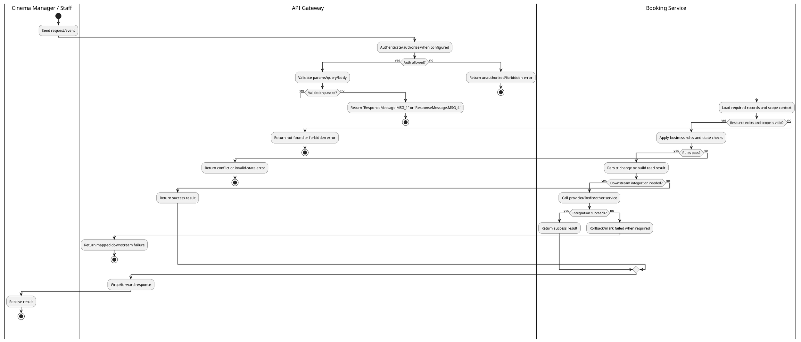

# [PY-A03] Cancel Payment

## 1. Description

| Field | Details |
| :--- | :--- |
| **Name** | Cancel Payment |
| **Functional ID** | PY-A03 |
| **Description** | Allows an Admin to manually mark a PENDING or PROCESSING payment as FAILED/CANCELLED. |
| **Actor** | Cinema Manager / Staff |
| **Trigger** | `PUT /v1/payments/admin/:id/cancel` |
| **Pre-condition** | Staff is authenticated with configured payment read/update permission and any filters are valid. |
| **Post-condition** | State change is persisted atomically or the request fails without partial data inconsistency. |

## 2. Sequence Flow

## 3. Activity Flow

## 4. Business Rules

| Activity Step | Rule ID | Description |
| :--- | :--- | :--- |
| Gateway guard | BR-PY-A03-01 | Request must pass ClerkAuthGuard, RoleGuard where configured, and permission decorators for cinema/global scope before service dispatch. |
| Input validation | BR-PY-A03-02 | Required path IDs (`id`, `bookingId`, or payment ID) must be present; lookup/cancel operations verify the referenced payment or booking before returning data or changing state. |
| Route/message boundary | BR-PY-A03-03 | Implemented trigger is `PUT /v1/payments/admin/:id/cancel` and service boundary uses `payment.cancel`; the gateway must not call stale or pluralized paths that differ from the controller. |
| Business/state rule | BR-PY-A03-04 | Payment ownership is checked through the related booking before exposing or mutating payment data for customer routes. |
| Business/state rule | BR-PY-A03-05 | Payment state transitions are `PROCESSING -> PENDING -> COMPLETED/FAILED`; `COMPLETED`, `FAILED`, and `REFUNDED` are terminal for normal provider callbacks. |
| Business/state rule | BR-PY-A03-06 | Manual payment cancel is allowed only for `PENDING` payments and transitions the payment to `FAILED`. |
| Business/state rule | BR-PY-A03-07 | Delete/cancel actions must be blocked when dependent records or invalid terminal states would cause data inconsistency. |
| Integration constraint | BR-PY-A03-08 | Integration stays inside Booking Service and Booking Database for this operation; gateway route uses the microservice pattern `payment.cancel` and must not re-query the provider unless reconciliation code is explicitly invoked. |
| Success response | BR-PY-A03-09 | Successful write/validation/state-changing operations return service data with `ResponseMessage.MSG_7` where the service wraps a ServiceResult; pure reads return the requested DTO/list. |
| Failure response | BR-PY-A03-10 | Expected failures include `Payment not found`, `Booking not found`, `You do not have access to this booking payments`, `Booking is not pending payment`, `Booking payment window has expired`, `Payment method {method} is not supported`, `Can only cancel pending payments`, and `Unable to initiate payment. Please retry later.` |
