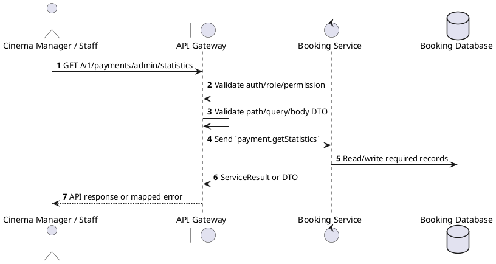
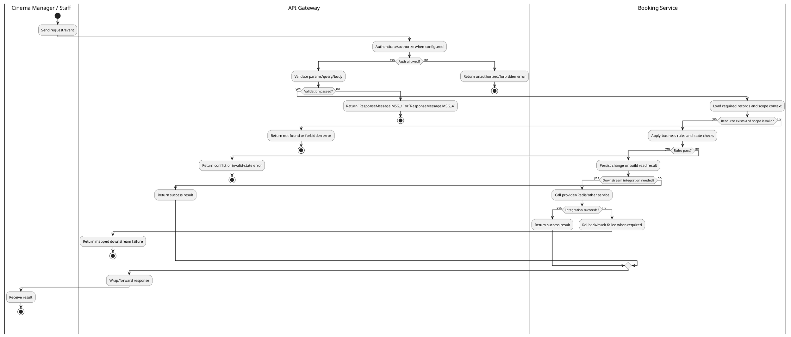

# [PY-A04] Get Payment Statistics

## 1. Description

| Field | Details |
| :--- | :--- |
| **Name** | Get Payment Statistics |
| **Functional ID** | PY-A04 |
| **Description** | Provides a summary of payment transactions, such as success rate and distribution of payment methods. |
| **Actor** | Cinema Manager / Staff |
| **Trigger** | `GET /v1/payments/admin/statistics` |
| **Pre-condition** | Staff is authenticated with configured payment read/update permission and any filters are valid. |
| **Post-condition** | Payment data/statistics are returned or the pending payment is cancelled without invalid state regression. |

## 2. Sequence Flow

## 3. Activity Flow

## 4. Business Rules

| Activity Step | Rule ID | Description |
| :--- | :--- | :--- |
| Gateway guard | BR-PY-A04-01 | Request must pass ClerkAuthGuard, RoleGuard where configured, and permission decorators for cinema/global scope before service dispatch. |
| Input validation | BR-PY-A04-02 | Admin payment filters accept PaymentStatus, payment method, start/end dates, and numeric pagination where supported; invalid enum or date values are rejected by the request layer/service. |
| Route/message boundary | BR-PY-A04-03 | Implemented trigger is `GET /v1/payments/admin/statistics` and service boundary uses `payment.getStatistics`; the gateway must not call stale or pluralized paths that differ from the controller. |
| Business/state rule | BR-PY-A04-04 | Payment ownership is checked through the related booking before exposing or mutating payment data for customer routes. |
| Business/state rule | BR-PY-A04-05 | Payment state transitions are `PROCESSING -> PENDING -> COMPLETED/FAILED`; `COMPLETED`, `FAILED`, and `REFUNDED` are terminal for normal provider callbacks. |
| Business/state rule | BR-PY-A04-06 | Read/list/statistics operations must not contact the provider adapter or mutate payment state unless reconciliation code is explicitly invoked. |
| Integration constraint | BR-PY-A04-07 | Integration stays inside Booking Service and Booking Database for this operation; gateway route uses the microservice pattern `payment.getStatistics` and must not re-query the provider unless reconciliation code is explicitly invoked. |
| Success response | BR-PY-A04-08 | Successful read operations return the requested DTO/list using the gateway's normal response wrapper; no artificial success text is invented by the spec. |
| Failure response | BR-PY-A04-09 | Expected failures include `Payment not found`, `Booking not found`, `You do not have access to this booking payments`, `Booking is not pending payment`, `Booking payment window has expired`, `Payment method {method} is not supported`, `Can only cancel pending payments`, and `Unable to initiate payment. Please retry later.` |
