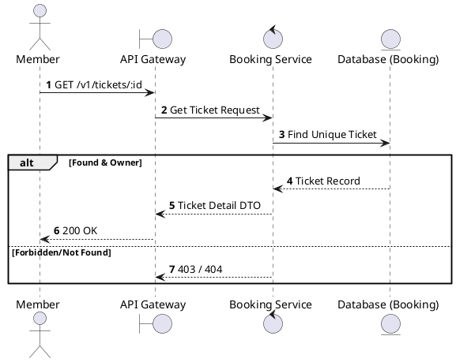
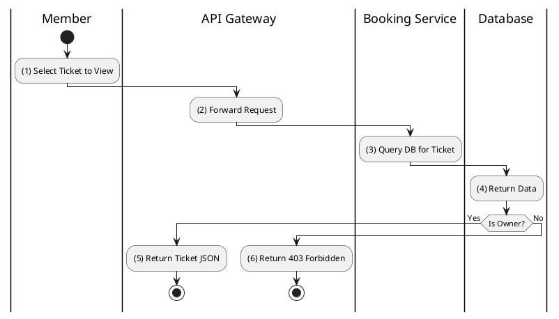

# [TK-01] Get Ticket Details

## 1. Description

| Field | Details |
| :--- | :--- |
| **Name** | Get Ticket Details |
| **Functional ID** | TK-01 |
| **Description** | Retrieves full information about a specific digital ticket, including seat number, showtime details, and its current validity status. |
| **Actor** | Member |
| **Trigger** | `GET /v1/tickets/:id` |
| **Pre-condition** | Member authenticated; Ticket ID exists and belongs to the member. |
| **Post-condition** | Ticket details returned. |

## 2. Sequence Flow

## 3. Activity Flow

## 4. Business Rules

| Activity Step | Rule ID | Description |
| :--- | :--- | :--- |
| (2) | BR203 | Only the member who bought the ticket or authorized staff can view detailed ticket information. |
| (3) | BR204 | Ticket status must be one of the `TicketStatus` enum values and must reflect the related booking/payment state. |
| (3) | BR205 | Confirmed tickets must include QR-ready data for e-ticket display and download. |
| (3) | BR206 | QR data must identify a unique ticket and must not expose mutable payment data, OTP values, or customer PII. |
| (5) | BR207 | Ticket details must remain accessible after payment confirmation for download, resend, and offline save workflows. |
| (5) | BR208 | Ticket layout data must include essential movie, cinema, hall, showtime, seat, and booking code information. |

