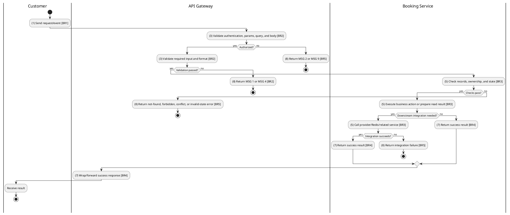
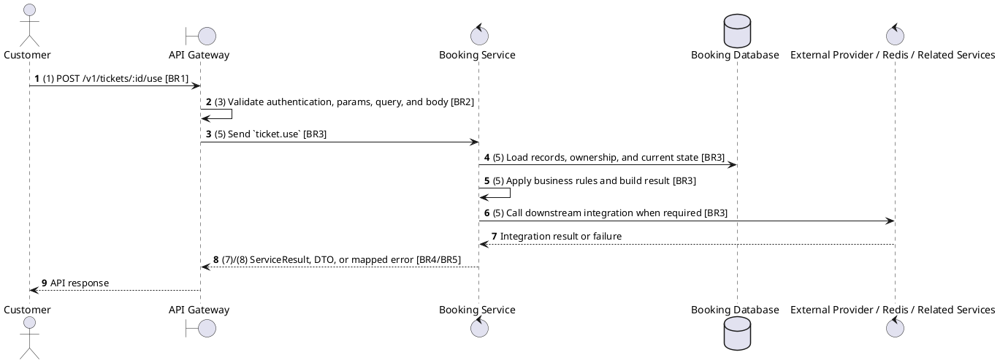

# [TK-04] Use Ticket

## Use Case Description

| Field | Details |
| :--- | :--- |
| **Name** | Use Ticket (Mark Entry) |
| **Description** | Marks a ticket as `USED` when the customer enters the cinema hall. This prevents the same ticket from being used twice. |
| **Actor** | Customer |
| **Trigger** | `POST /v1/tickets/:id/use` |
| **Pre-condition** | Ticket exists and caller has owner or cinema validation permission. |
| **Post-condition** | State change is persisted atomically or the request fails without partial data inconsistency. |

## Activities Flow

## Sequence Flow

## Business Rules

| Activity | BR Code | Description |
| :--- | :--- | :--- |
| (1) | BR1 | Loading Screen Rules: ❖ The system loads the "Use Ticket (Mark Entry)" function and receives the request/event. ❖ The system uses trigger [POST /v1/tickets/:id/use]. |
| (3) | BR2 | Validate Rules: ❖ The system checks the items [id]. ❖ Required fields: [id]. ❖ If any required entries are empty, the system shows error message MSG 1. ❖ Field constraint: [id] is required, type string, path parameter. ❖ If any type, format, enum, range, date, UUID, or email constraint is invalid, the system shows error message MSG 4. |
| (5) | BR3 | Processing Rules: ❖ Ticket states are VALID, USED, CANCELLED, and EXPIRED; used tickets cannot be cancelled and invalid tickets cannot be used for entry. ❖ Ticket delivery depends on confirmed payment/booking flow and notification/outbox delivery where enabled; lookup must still work from persisted ticket data. ❖ Integration uses Booking Service ticket module and, for QR or delivery, notification/outbox/digital delivery components where enabled; microservice pattern ticket.use. |
| (7) | BR4 | Message Rules: ❖ Successful write/validation/state-changing operations return service data with MSG 7 where the service wraps a ServiceResult; pure reads return the requested DTO/list. |
| (8) | BR5 | Error Handling Rules: ❖ Expected failures include Ticket not found, invalid ticket status during validation/use, and Cannot cancel a used ticket for cancellation. ❖ If a constraint, conflict, or unexpected failure occurs, the system shows error message MSG 9. |
