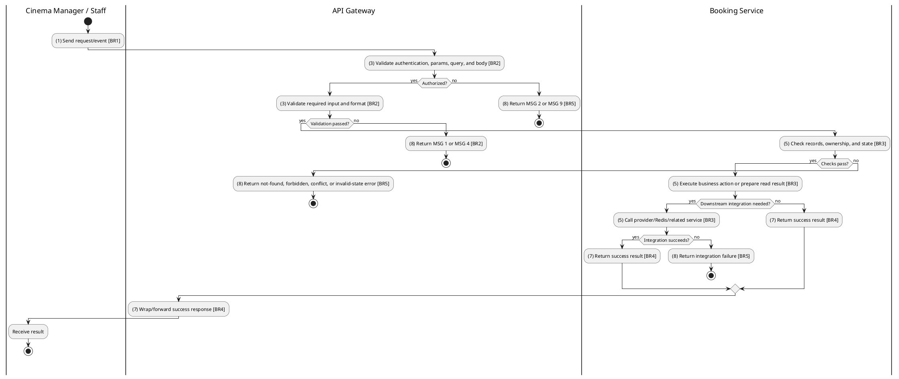
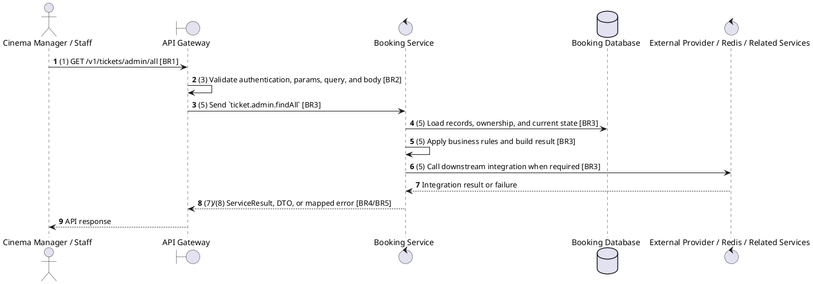

# [TK-A01] Admin List All Tickets

## Use Case Description

| Field | Details |
| :--- | :--- |
| **Name** | Admin List All Tickets |
| **Description** | Allows Administrators to view a paginated list of all tickets issued in the system. |
| **Actor** | Cinema Manager / Staff |
| **Trigger** | `GET /v1/tickets/admin/all` |
| **Pre-condition** | Ticket exists and caller has owner or cinema validation permission. |
| **Post-condition** | Ticket details/QR are returned or ticket state is updated consistently. |

## Activities Flow

## Sequence Flow

## Business Rules

| Activity | BR Code | Description |
| :--- | :--- | :--- |
| (1) | BR1 | Loading Screen Rules: ❖ The system loads the "Admin List All Tickets" function and receives the request/event. ❖ The system uses trigger [GET /v1/tickets/admin/all]. |
| (3) | BR2 | Validate Rules: ❖ The system checks the items [page], [limit], [bookingId], [showtimeId], [status], [startDate], [endDate]. ❖ The system validates data according to DTO/schema AdminFindAllTicketsDto. ❖ Optional fields: [page], [limit], [bookingId], [showtimeId], [status], [startDate], [endDate]. ❖ Field constraint: [page] is optional, type number. ❖ Field constraint: [limit] is optional, type number. ❖ Field constraint: [bookingId] is optional, type string. ❖ Field constraint: [showtimeId] is optional, type string. ❖ Field constraint: [status] is optional, type TicketStatus. ❖ Field constraint: [startDate] is optional, type Date. ❖ Field constraint: [endDate] is optional, type Date. ❖ If any type, format, enum, range, date, UUID, or email constraint is invalid, the system shows error message MSG 4. |
| (5) | BR3 | Retrieval Rules: ❖ Ticket states are VALID, USED, CANCELLED, and EXPIRED; used tickets cannot be cancelled and invalid tickets cannot be used for entry. ❖ Ticket delivery depends on confirmed payment/booking flow and notification/outbox delivery where enabled; lookup must still work from persisted ticket data. ❖ List responses must honor supported filters, pagination defaults, and cinema/user scoping before returning data. ❖ Integration uses Booking Service ticket module and, for QR or delivery, notification/outbox/digital delivery components where enabled; microservice pattern ticket.admin.findAll. |
| (7) | BR4 | Message Rules: ❖ Successful write/validation/state-changing operations return service data with MSG 7 where the service wraps a ServiceResult; pure reads return the requested DTO/list. |
| (8) | BR5 | Error Handling Rules: ❖ Expected failures include Ticket not found, invalid ticket status during validation/use, and Cannot cancel a used ticket for cancellation. ❖ If a constraint, conflict, or unexpected failure occurs, the system shows error message MSG 9. |
