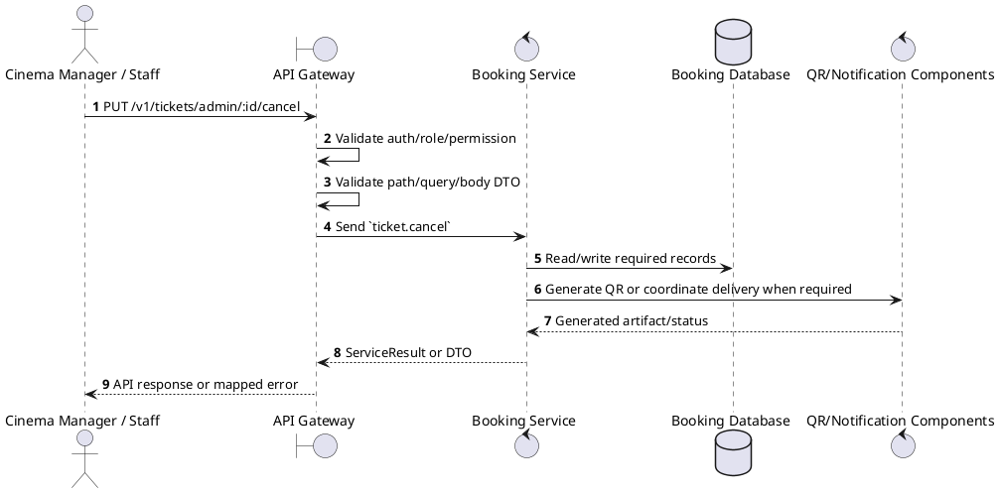
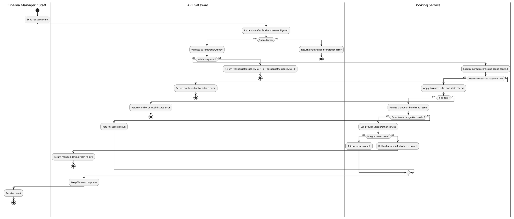

# [TK-A05] Cancel Ticket

## 1. Description

| Field | Details |
| :--- | :--- |
| **Name** | Cancel Ticket |
| **Functional ID** | TK-A05 |
| **Description** | Allows an Admin to manually cancel an individual ticket (without necessarily cancelling the entire booking). |
| **Actor** | Cinema Manager / Staff |
| **Trigger** | `PUT /v1/tickets/admin/:id/cancel` |
| **Pre-condition** | Ticket exists and caller has owner or cinema validation permission. |
| **Post-condition** | State change is persisted atomically or the request fails without partial data inconsistency. |

## 2. Sequence Flow

## 3. Activity Flow

## 4. Business Rules

| Activity Step | Rule ID | Description |
| :--- | :--- | :--- |
| Gateway guard | BR-TK-A05-01 | Request must pass ClerkAuthGuard, RoleGuard where configured, and permission decorators for cinema/global scope before service dispatch. |
| Input validation | BR-TK-A05-02 | Ticket IDs or ticket codes are required; validation may include `validationCode` and `cinemaId`; bulk validation requires a ticket list payload matching BulkValidateTicketsDto. |
| Route/message boundary | BR-TK-A05-03 | Implemented trigger is `PUT /v1/tickets/admin/:id/cancel` and service boundary uses `ticket.cancel`; the gateway must not call stale or pluralized paths that differ from the controller. |
| Business/state rule | BR-TK-A05-04 | Customer ticket reads and QR generation require ownership through the ticket's booking; staff validation endpoints require cinema-scope permissions. |
| Business/state rule | BR-TK-A05-05 | Ticket states are `VALID`, `USED`, `CANCELLED`, and `EXPIRED`; used tickets cannot be cancelled and invalid tickets cannot be used for entry. |
| Business/state rule | BR-TK-A05-06 | QR payloads are generated from persisted ticket identity/code and must remain unique and tamper-resistant; duplicate code reuse must be rejected during validation. |
| Business/state rule | BR-TK-A05-07 | Ticket delivery depends on confirmed payment/booking flow and notification/outbox delivery where enabled; lookup must still work from persisted ticket data. |
| Business/state rule | BR-TK-A05-08 | Delete/cancel actions must be blocked when dependent records or invalid terminal states would cause data inconsistency. |
| Integration constraint | BR-TK-A05-09 | Integration uses Booking Service ticket module and, for QR or delivery, notification/outbox/digital delivery components where enabled; microservice pattern `ticket.cancel`. |
| Success response | BR-TK-A05-10 | Successful write/validation/state-changing operations return service data with `ResponseMessage.MSG_7` where the service wraps a ServiceResult; pure reads return the requested DTO/list. |
| Failure response | BR-TK-A05-11 | Expected failures include `Ticket not found`, invalid ticket status during validation/use, and `Cannot cancel a used ticket` for cancellation. |
