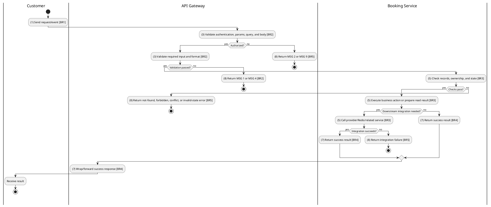
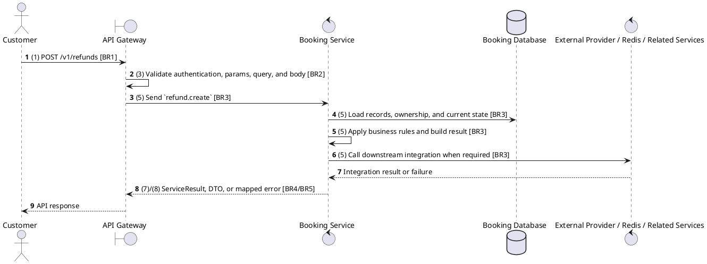

# [RF-01] Create Refund Request

## Use Case Description

| Field | Details |
| :--- | :--- |
| **Name** | Create Refund Request |
| **Description** | Allows a Member to submit a formal request for a refund after cancelling a booking. |
| **Actor** | Customer |
| **Trigger** | `POST /v1/refunds` |
| **Pre-condition** | Caller satisfies gateway auth/permission requirements and request data matches shared DTO/query schema. |
| **Post-condition** | State change is persisted atomically or the request fails without partial data inconsistency. |

## Activities Flow

## Sequence Flow

## Business Rules

| Activity | BR Code | Description |
| :--- | :--- | :--- |
| (1) | BR1 | Loading Screen Rules: ❖ The system loads the "Create Refund Request" function and receives the request/event. ❖ The system uses trigger [POST /v1/refunds]. |
| (3) | BR2 | Validate Rules: ❖ The system checks the items [paymentId], [amount], [reason]. ❖ The system validates data according to DTO/schema CreateRefundDto. ❖ Required fields: [paymentId], [amount], [reason]. ❖ If any required entries are empty, the system shows error message MSG 1. ❖ Field constraint: [paymentId] is required, type string. ❖ Field constraint: [amount] is required, type number. ❖ Field constraint: [reason] is required, type string. ❖ If any type, format, enum, range, date, UUID, or email constraint is invalid, the system shows error message MSG 4. |
| (5) | BR3 | Creating Rules: ❖ Refunds can only be created for existing completed payments or confirmed bookings that satisfy refund policy constraints. ❖ Refund status transitions are PENDING -> PROCESSING -> COMPLETED or PENDING -> FAILED/REJECTED; completed/rejected states must not be overwritten by stale actions. ❖ Voucher refunds create a fixed-amount promotion voucher for eligible bookings and then update booking/payment/ticket state consistently. ❖ Seat release for refunded bookings is delegated to Cinema Service/Redis release flow after refund state is persisted. ❖ Integration coordinates Booking, Payment, Ticket, Promotion voucher, Cinema seat release, and uses microservice pattern refund.create. ❖ Create actions must reject duplicate/conflicting records before persistence and return the created DTO after persistence. |
| (7) | BR4 | Message Rules: ❖ Successful write/validation/state-changing operations return service data with MSG 7 where the service wraps a ServiceResult; pure reads return the requested DTO/list. |
| (8) | BR5 | Error Handling Rules: ❖ Expected failures include Payment not found, Can only refund completed payments, Refund not found, Can only process pending refunds, Can only reject pending refunds, Booking not found, Cannot fetch showtime information, Showtime information not available, and No ticket amount to refund. ❖ If a constraint, conflict, or unexpected failure occurs, the system shows error message MSG 9. |
