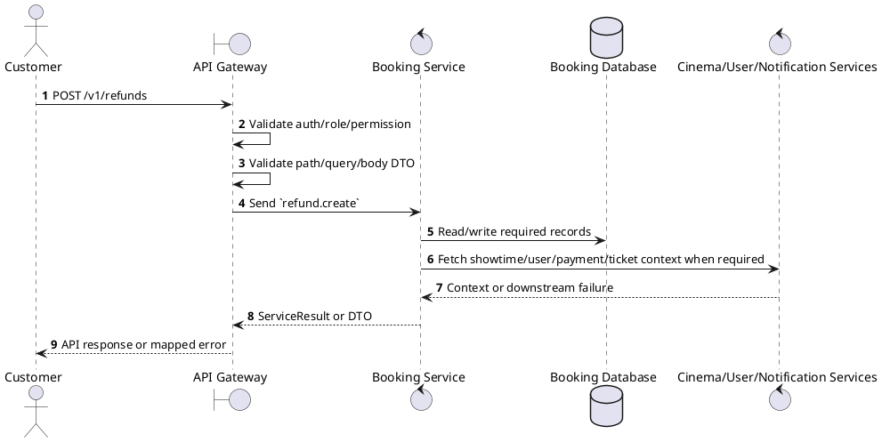
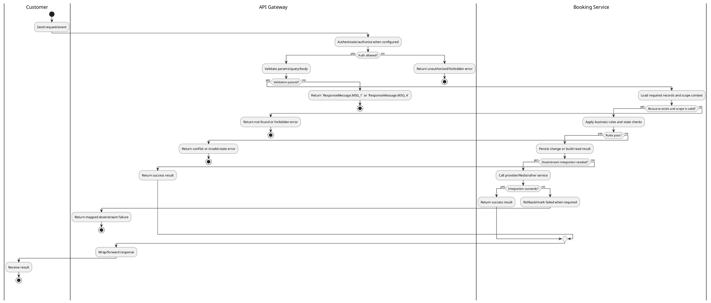

# [RF-01] Create Refund Request

## 1. Description

| Field | Details |
| :--- | :--- |
| **Name** | Create Refund Request |
| **Functional ID** | RF-01 |
| **Description** | Allows a Member to submit a formal request for a refund after cancelling a booking. |
| **Actor** | Customer |
| **Trigger** | `POST /v1/refunds` |
| **Pre-condition** | Caller satisfies gateway auth/permission requirements and request data matches shared DTO/query schema. |
| **Post-condition** | State change is persisted atomically or the request fails without partial data inconsistency. |

## 2. Sequence Flow

## 3. Activity Flow

## 4. Business Rules

| Activity Step | Rule ID | Description |
| :--- | :--- | :--- |
| Gateway guard | BR-RF-01-01 | Customer request must pass ClerkAuthGuard; own-scope permissions and ownership checks prevent access to another user's booking, payment, ticket, loyalty, or refund data. |
| Input validation | BR-RF-01-02 | Refund DTOs require the referenced payment/refund/booking IDs and action-specific reason/provider fields; status filters use RefundStatus values. |
| Route/message boundary | BR-RF-01-03 | Implemented trigger is `POST /v1/refunds` and service boundary uses `refund.create`; the gateway must not call stale or pluralized paths that differ from the controller. |
| Business/state rule | BR-RF-01-04 | Refunds can only be created for existing completed payments or confirmed bookings that satisfy refund policy constraints. |
| Business/state rule | BR-RF-01-05 | Refund status transitions are `PENDING -> PROCESSING -> COMPLETED` or `PENDING -> FAILED/REJECTED`; completed/rejected states must not be overwritten by stale actions. |
| Business/state rule | BR-RF-01-06 | Voucher refunds create a fixed-amount promotion voucher for eligible bookings and then update booking/payment/ticket state consistently. |
| Business/state rule | BR-RF-01-07 | Seat release for refunded bookings is delegated to Cinema Service/Redis release flow after refund state is persisted. |
| Business/state rule | BR-RF-01-08 | Create actions must reject duplicate/conflicting records before persistence and return the created DTO after persistence. |
| Integration constraint | BR-RF-01-09 | Integration coordinates Booking, Payment, Ticket, Promotion voucher, Cinema seat release, and uses microservice pattern `refund.create`. |
| Success response | BR-RF-01-10 | Successful write/validation/state-changing operations return service data with `ResponseMessage.MSG_7` where the service wraps a ServiceResult; pure reads return the requested DTO/list. |
| Failure response | BR-RF-01-11 | Expected failures include `Payment not found`, `Can only refund completed payments`, `Refund not found`, `Can only process pending refunds`, `Can only reject pending refunds`, `Booking not found`, `Cannot fetch showtime information`, `Showtime information not available`, and `No ticket amount to refund`. |
