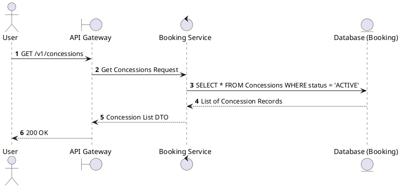
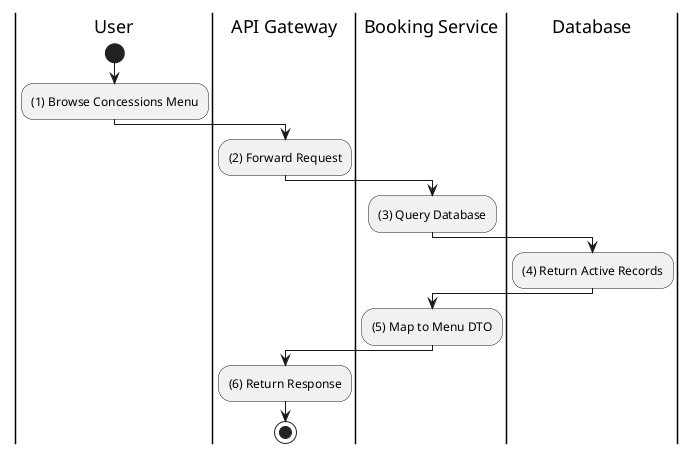

# [CS-01] List Concessions

## 1. Description

| Field | Details |
| :--- | :--- |
| **Name** | List Concessions |
| **Functional ID** | CS-01 |
| **Description** | Retrieves a list of all food and beverage items (concessions) available for purchase. |
| **Actor** | Guest, Member |
| **Trigger** | `GET /v1/concessions` |
| **Pre-condition** | None. |
| **Post-condition** | List of concession items returned. |

## 2. Sequence Flow

## 3. Activity Flow

## 4. Business Rules

| Activity Step | Rule ID | Description |
| :--- | :--- | :--- |
| (4) | BR190 | Items must be categorized by `ConcessionCategory` (FOOD, DRINK, COMBO, MERCHANDISE); category is required in the DTO. |
| (4) | BR191 | Only items where `is_active = true` and stock > 0 should be included in public listings; otherwise they must be excluded. |

