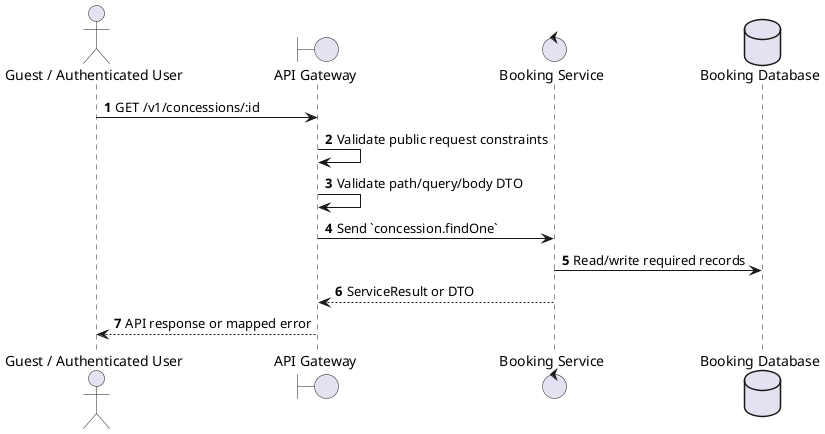
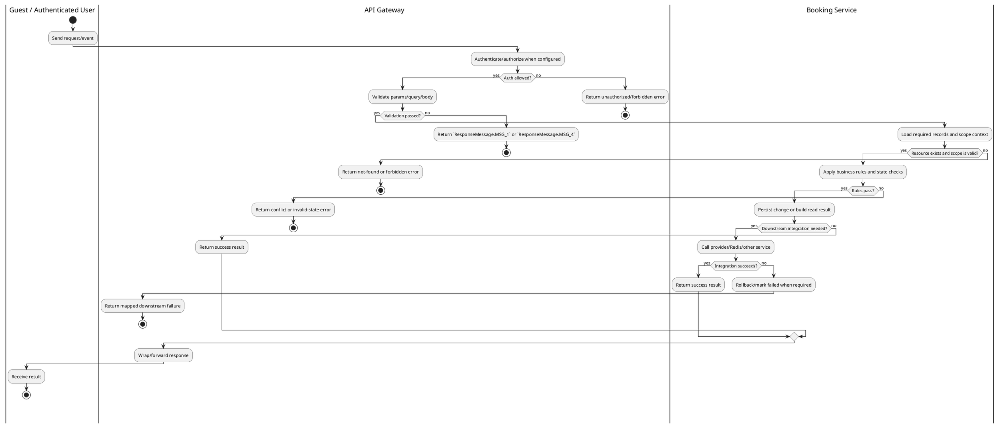

# [CS-02] Get Concession Details

## 1. Description

| Field | Details |
| :--- | :--- |
| **Name** | Get Concession Details |
| **Functional ID** | CS-02 |
| **Description** | Retrieves full information about a specific concession item, including description, ingredients, and nutritional info (if available). |
| **Actor** | Guest / Authenticated User |
| **Trigger** | `GET /v1/concessions/:id` |
| **Pre-condition** | Required path/query parameters are provided; no customer session is required for this read. |
| **Post-condition** | Requested data is returned or the targeted state change is persisted consistently. |

## 2. Sequence Flow

## 3. Activity Flow

## 4. Business Rules

| Activity Step | Rule ID | Description |
| :--- | :--- | :--- |
| Gateway guard | BR-CS-02-01 | Read operation is public unless the gateway method explicitly applies ClerkAuthGuard; staff cinema context may still restrict scoped results when present. |
| Input validation | BR-CS-02-02 | Concession create requires `name`, `category`, and `price`; category must be ConcessionCategory, price/inventory must be numeric, and inventory updates require numeric `quantity`. |
| Route/message boundary | BR-CS-02-03 | Implemented trigger is `GET /v1/concessions/:id` and service boundary uses `concession.findOne`; the gateway must not call stale or pluralized paths that differ from the controller. |
| Business/state rule | BR-CS-02-04 | Concession lookups can filter by cinema, category, and availability; create/update normalizes price and inventory values. |
| Business/state rule | BR-CS-02-05 | Unavailable or out-of-stock concessions cannot be used by booking price calculation. |
| Business/state rule | BR-CS-02-06 | Delete must respect existing order/booking references; service constraint failures map to the propagated service error. |
| Business/state rule | BR-CS-02-07 | Inventory update adjusts the persisted inventory number atomically for the targeted concession. |
| Integration constraint | BR-CS-02-08 | Gateway forwards the request to the target service through microservice pattern `concession.findOne` and propagates service errors through the common exception layer. |
| Success response | BR-CS-02-09 | Successful read operations return the requested DTO/list using the gateway's normal response wrapper; no artificial success text is invented by the spec. |
| Failure response | BR-CS-02-10 | Expected failures include `Concession not found`, invalid price/inventory format, duplicate name/category constraints, unavailable concession, and relation constraint failures. |
