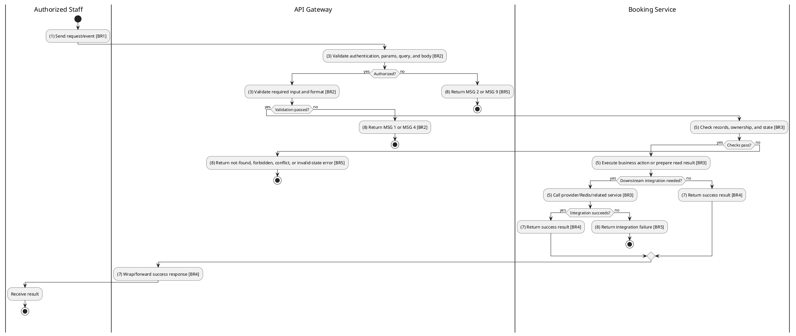
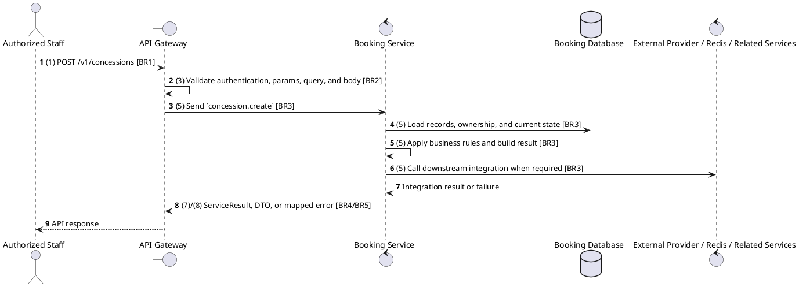

# [CS-03] Create Concession

## Use Case Description

| Field | Details |
| :--- | :--- |
| **Name** | Create Concession |
| **Description** | Allows an Administrator to add a new food or beverage item to the catalog. |
| **Actor** | Authorized Staff |
| **Trigger** | `POST /v1/concessions` |
| **Pre-condition** | Caller satisfies gateway auth/permission requirements and request data matches shared DTO/query schema. |
| **Post-condition** | State change is persisted atomically or the request fails without partial data inconsistency. |

## Activities Flow

## Sequence Flow

## Business Rules

| Activity | BR Code | Description |
| :--- | :--- | :--- |
| (1) | BR1 | Loading Screen Rules: ❖ The system loads the "Create Concession" function and receives the request/event. ❖ The system uses trigger [POST /v1/concessions]. |
| (3) | BR2 | Validate Rules: ❖ The system checks the items [name], [nameEn], [description], [category], [price], [imageUrl], [available], [inventory], [cinemaId], [nutritionInfo], [allergens]. ❖ The system validates data according to DTO/schema CreateConcessionDto. ❖ Required fields: [name], [category], [price]. ❖ If any required entries are empty, the system shows error message MSG 1. ❖ Optional fields: [nameEn], [description], [imageUrl], [available], [inventory], [cinemaId], [nutritionInfo], [allergens]. ❖ Field constraint: [name] is required, type string. ❖ Field constraint: [nameEn] is optional, type string. ❖ Field constraint: [description] is optional, type string. ❖ Field constraint: [category] is required, type ConcessionCategory. ❖ Field constraint: [price] is required, type number. ❖ Field constraint: [imageUrl] is optional, type string. ❖ Field constraint: [available] is optional, type boolean. ❖ Field constraint: [inventory] is optional, type number. ❖ Field constraint: [cinemaId] is optional, type string. ❖ Field constraint: [nutritionInfo] is optional, type Record<string, any>. ❖ Field constraint: [allergens] is optional, type string[]. ❖ If any type, format, enum, range, date, UUID, or email constraint is invalid, the system shows error message MSG 4. |
| (5) | BR3 | Creating Rules: ❖ Concession create requires name, category, and price; category must be ConcessionCategory, price/inventory must be numeric, and inventory updates require numeric quantity. ❖ Concession lookups can filter by cinema, category, and availability; create/update normalizes price and inventory values. ❖ Unavailable or out-of-stock concessions cannot be used by booking price calculation. ❖ Inventory update adjusts the persisted inventory number atomically for the targeted concession. ❖ Create actions must reject duplicate/conflicting records before persistence and return the created DTO after persistence. |
| (7) | BR4 | Message Rules: ❖ Successful write/validation/state-changing operations return service data with MSG 7 where the service wraps a ServiceResult; pure reads return the requested DTO/list. |
| (8) | BR5 | Error Handling Rules: ❖ Delete must respect existing order/booking references; service constraint failures map to the propagated service error. ❖ Gateway forwards the request to the target service through microservice pattern concession.create and propagates service errors through the common exception layer. ❖ Expected failures include Concession not found, invalid price/inventory format, duplicate name/category constraints, unavailable concession, and relation constraint failures. ❖ If a constraint, conflict, or unexpected failure occurs, the system shows error message MSG 9. |
