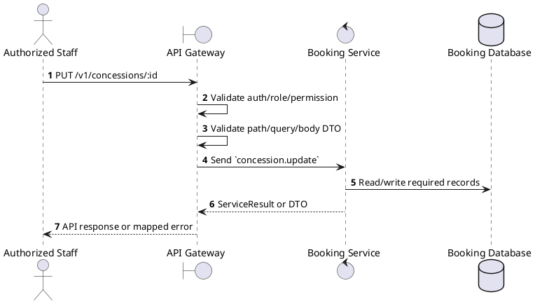
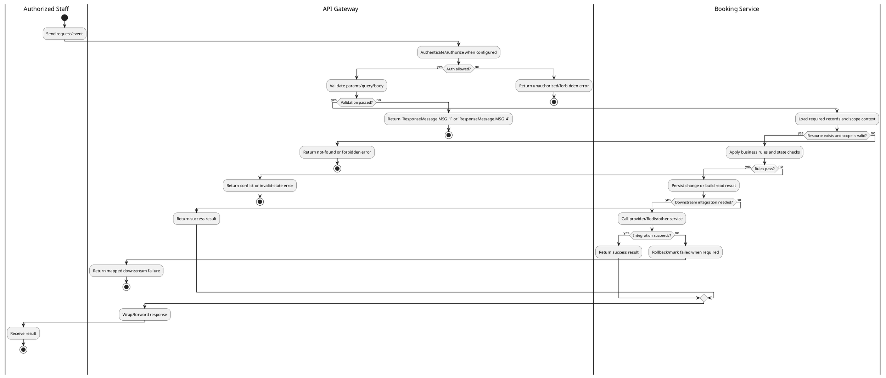

# [CS-04] Update Concession

## 1. Description

| Field | Details |
| :--- | :--- |
| **Name** | Update Concession |
| **Functional ID** | CS-04 |
| **Description** | Modifies the information of an existing concession item. |
| **Actor** | Authorized Staff |
| **Trigger** | `PUT /v1/concessions/:id` |
| **Pre-condition** | Caller satisfies gateway auth/permission requirements and request data matches shared DTO/query schema. |
| **Post-condition** | State change is persisted atomically or the request fails without partial data inconsistency. |

## 2. Sequence Flow

## 3. Activity Flow

## 4. Business Rules

| Activity Step | Rule ID | Description |
| :--- | :--- | :--- |
| Gateway guard | BR-CS-04-01 | Request must pass ClerkAuthGuard and the configured Permission decorator before the gateway forwards the command. |
| Input validation | BR-CS-04-02 | Concession create requires `name`, `category`, and `price`; category must be ConcessionCategory, price/inventory must be numeric, and inventory updates require numeric `quantity`. |
| Route/message boundary | BR-CS-04-03 | Implemented trigger is `PUT /v1/concessions/:id` and service boundary uses `concession.update`; the gateway must not call stale or pluralized paths that differ from the controller. |
| Business/state rule | BR-CS-04-04 | Concession lookups can filter by cinema, category, and availability; create/update normalizes price and inventory values. |
| Business/state rule | BR-CS-04-05 | Unavailable or out-of-stock concessions cannot be used by booking price calculation. |
| Business/state rule | BR-CS-04-06 | Delete must respect existing order/booking references; service constraint failures map to the propagated service error. |
| Business/state rule | BR-CS-04-07 | Inventory update adjusts the persisted inventory number atomically for the targeted concession. |
| Business/state rule | BR-CS-04-08 | Update actions must merge only allowed DTO fields and leave omitted fields unchanged. |
| Integration constraint | BR-CS-04-09 | Gateway forwards the request to the target service through microservice pattern `concession.update` and propagates service errors through the common exception layer. |
| Success response | BR-CS-04-10 | Successful write/validation/state-changing operations return service data with `ResponseMessage.MSG_7` where the service wraps a ServiceResult; pure reads return the requested DTO/list. |
| Failure response | BR-CS-04-11 | Expected failures include `Concession not found`, invalid price/inventory format, duplicate name/category constraints, unavailable concession, and relation constraint failures. |
